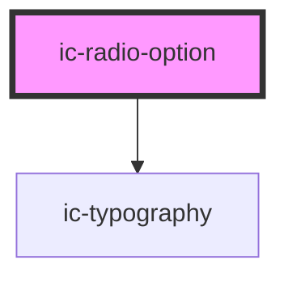

# ic-radio-option

<!-- Auto Generated Below -->

## Properties

| Property                 | Attribute                  | Description                                                                                                                                                         | Type                    | Default                                        |
| ------------------------ | -------------------------- | ------------------------------------------------------------------------------------------------------------------------------------------------------------------- | ----------------------- | ---------------------------------------------- |
| `additionalFieldDisplay` | `additional-field-display` | The style of additionalField that will be displayed if used.                                                                                                        | `"dynamic" \| "static"` | `"static"`                                     |
| `disabled`               | `disabled`                 | If `true`, the disabled state will be set.                                                                                                                          | `boolean`               | `false`                                        |
| `dynamicText`            | `dynamic-text`             | The text to be displayed when dynamic.                                                                                                                              | `string`                | `"This selection requires additional answers"` |
| `form`                   | `form`                     | The <form> element to associate the radio with.                                                                                                                     | `string`                | `undefined`                                    |
| `formaction`             | `formaction`               | The URL that processes the information submitted by the radio. It overrides the action attribute of the radio's form owner. Does nothing if there is no form owner. | `string`                | `undefined`                                    |
| `formenctype`            | `formenctype`              | The way the submitted form data is encoded.                                                                                                                         | `string`                | `undefined`                                    |
| `formmethod`             | `formmethod`               | The HTTP method used to submit the form.                                                                                                                            | `string`                | `undefined`                                    |
| `formnovalidate`         | `formnovalidate`           | If `true`, the form will not be validated when submitted.                                                                                                           | `boolean`               | `undefined`                                    |
| `formtarget`             | `formtarget`               | The place to display the response from submitting the form. It overrides the target attribute of the radio's form owner.                                            | `string`                | `undefined`                                    |
| `groupLabel`             | `group-label`              | The group label for the radio option.                                                                                                                               | `string`                | `undefined`                                    |
| `label`                  | `label`                    | The label for the radio option.                                                                                                                                     | `string`                | `undefined`                                    |
| `name`                   | `name`                     | The name for the radio option.                                                                                                                                      | `string`                | `undefined`                                    |
| `selected`               | `selected`                 | If `true`, the radio option will be displayed in a selected state.                                                                                                  | `boolean`               | `false`                                        |
| `value` _(required)_     | `value`                    | The value for the radio option.                                                                                                                                     | `string`                | `undefined`                                    |

## Events

| Event              | Description                                              | Type                              |
| ------------------ | -------------------------------------------------------- | --------------------------------- |
| `icCheck`          | Emitted when the radio option is selected.               | `CustomEvent<IcValueEventDetail>` |
| `icSelectedChange` | Emitted when the radio option is selected or deselected. | `CustomEvent<void>`               |

## Methods

### `setFocus() => Promise<void>`

Sets focus on the radio option.

#### Returns

Type: `Promise<void>`

## Slots

| Slot                 | Description                                    |
| -------------------- | ---------------------------------------------- |
| `"additional-field"` | Content to displayed alongside a radio option. |

## Dependencies

### Depends on

- [ic-typography](../ic-typography)

### Graph

----------------------------------------------

