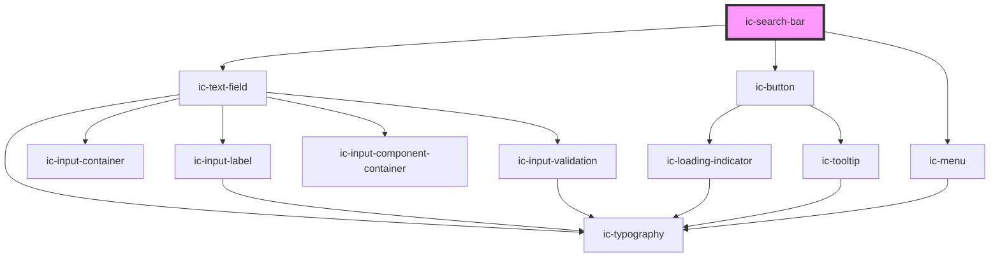

# ic-search-bar

<!-- Auto Generated Below -->

## Properties

| Property                    | Attribute                     | Description                                                                                                                                                                                   | Type                                                                                                                                                                                                                                                                                                                                                                                                                                                                                                                                                                                                                                                                                                                                                                                                                                                                                                                        | Default                                                                                                    |
| --------------------------- | ----------------------------- | --------------------------------------------------------------------------------------------------------------------------------------------------------------------------------------------- | --------------------------------------------------------------------------------------------------------------------------------------------------------------------------------------------------------------------------------------------------------------------------------------------------------------------------------------------------------------------------------------------------------------------------------------------------------------------------------------------------------------------------------------------------------------------------------------------------------------------------------------------------------------------------------------------------------------------------------------------------------------------------------------------------------------------------------------------------------------------------------------------------------------------------- | ---------------------------------------------------------------------------------------------------------- |
| `autocapitalize`            | `autocapitalize`              | Indicates whether and how the text value should be automatically capitalized as it is entered/edited by the user. Available options: "off", "none", "on", "sentences", "words", "characters". | `string`                                                                                                                                                                                                                                                                                                                                                                                                                                                                                                                                                                                                                                                                                                                                                                                                                                                                                                                    | `"off"`                                                                                                    |
| `autocomplete`              | `autocomplete`                | Indicates whether the value of the control can be automatically completed by the browser.                                                                                                     | `"name" \| "on" \| "off" \| "honorific-prefix" \| "given-name" \| "additional-name" \| "family-name" \| "honorific-suffix" \| "nickname" \| "email" \| "username" \| "new-password" \| "current-password" \| "one-time-code" \| "organization-title" \| "organization" \| "street-address" \| "address-line1" \| "address-line2" \| "address-line3" \| "address-level4" \| "address-level3" \| "address-level2" \| "address-level1" \| "country" \| "country-name" \| "postal-code" \| "cc-name" \| "cc-given-name" \| "cc-additional-name" \| "cc-family-name" \| "cc-number" \| "cc-exp" \| "cc-exp-month" \| "cc-exp-year" \| "cc-csc" \| "cc-type" \| "transaction-currency" \| "transaction-amount" \| "language" \| "bday" \| "bday-day" \| "bday-month" \| "bday-year" \| "sex" \| "tel" \| "tel-country-code" \| "tel-national" \| "tel-area-code" \| "tel-local" \| "tel-extension" \| "impp" \| "url" \| "photo"` | `"off"`                                                                                                    |
| `autocorrect`               | `autocorrect`                 | Whether auto correction should be enabled when the user is entering/editing the text value.                                                                                                   | `"off" \| "on"`                                                                                                                                                                                                                                                                                                                                                                                                                                                                                                                                                                                                                                                                                                                                                                                                                                                                                                             | `"off"`                                                                                                    |
| `autofocus`                 | `autofocus`                   | This Boolean attribute lets you specify that a form control should have input focus when the page loads.                                                                                      | `boolean`                                                                                                                                                                                                                                                                                                                                                                                                                                                                                                                                                                                                                                                                                                                                                                                                                                                                                                                   | `false`                                                                                                    |
| `charactersUntilSuggestion` | `characters-until-suggestion` | Number of characters until suggestions appear                                                                                                                                                 | `number`                                                                                                                                                                                                                                                                                                                                                                                                                                                                                                                                                                                                                                                                                                                                                                                                                                                                                                                    | `2`                                                                                                        |
| `debounce`                  | `debounce`                    | Set the amount of time, in milliseconds, to wait to trigger the `icChange` event after each keystroke.                                                                                        | `number`                                                                                                                                                                                                                                                                                                                                                                                                                                                                                                                                                                                                                                                                                                                                                                                                                                                                                                                    | `0`                                                                                                        |
| `disableFilter`             | `disable-filter`              | Specify whether to disable the built in filtering. For example, if options will already be filtered from external source. If true, all options provided will be displayed.                    | `boolean`                                                                                                                                                                                                                                                                                                                                                                                                                                                                                                                                                                                                                                                                                                                                                                                                                                                                                                                   | `false`                                                                                                    |
| `disabled`                  | `disabled`                    | Specify whether the input is disabled.                                                                                                                                                        | `boolean`                                                                                                                                                                                                                                                                                                                                                                                                                                                                                                                                                                                                                                                                                                                                                                                                                                                                                                                   | `false`                                                                                                    |
| `emptyOptionListText`       | `empty-option-list-text`      | Provide text for empty results list                                                                                                                                                           | `string`                                                                                                                                                                                                                                                                                                                                                                                                                                                                                                                                                                                                                                                                                                                                                                                                                                                                                                                    | `"No results found"`                                                                                       |
| `focusOnLoad`               | `focus-on-load`               | Specify whether the input should be focussed when component loaded.                                                                                                                           | `boolean`                                                                                                                                                                                                                                                                                                                                                                                                                                                                                                                                                                                                                                                                                                                                                                                                                                                                                                                   | `false`                                                                                                    |
| `fullWidth`                 | `full-width`                  | Specify whether the component fills the full width of the container. If true, this overrides the --input-width css prop.                                                                      | `boolean`                                                                                                                                                                                                                                                                                                                                                                                                                                                                                                                                                                                                                                                                                                                                                                                                                                                                                                                   | `false`                                                                                                    |
| `helperText`                | `helper-text`                 | Provide helper text to display additional field guidance.                                                                                                                                     | `string`                                                                                                                                                                                                                                                                                                                                                                                                                                                                                                                                                                                                                                                                                                                                                                                                                                                                                                                    | `""`                                                                                                       |
| `hideLabel`                 | `hide-label`                  | Hides the label and applies the required label value as an aria-label.                                                                                                                        | `boolean`                                                                                                                                                                                                                                                                                                                                                                                                                                                                                                                                                                                                                                                                                                                                                                                                                                                                                                                   | `false`                                                                                                    |
| `hintText`                  | `hint-text`                   | Provide hint text for hidden assistive description element.                                                                                                                                   | `string`                                                                                                                                                                                                                                                                                                                                                                                                                                                                                                                                                                                                                                                                                                                                                                                                                                                                                                                    | `"When autocomplete results are available use the up and down arrows to choose and press enter to select"` |
| `label` _(required)_        | `label`                       | Provide a label for the input.                                                                                                                                                                | `string`                                                                                                                                                                                                                                                                                                                                                                                                                                                                                                                                                                                                                                                                                                                                                                                                                                                                                                                    | `undefined`                                                                                                |
| `name`                      | `name`                        | The name of the control, which is submitted with the form data.                                                                                                                               | `string`                                                                                                                                                                                                                                                                                                                                                                                                                                                                                                                                                                                                                                                                                                                                                                                                                                                                                                                    | `this.inputId`                                                                                             |
| `options`                   | --                            | Provide the suggested search options                                                                                                                                                          | `IcMenuOption[]`                                                                                                                                                                                                                                                                                                                                                                                                                                                                                                                                                                                                                                                                                                                                                                                                                                                                                                            | `[]`                                                                                                       |
| `placeholder`               | `placeholder`                 | Provide a placeholder value to display.                                                                                                                                                       | `string`                                                                                                                                                                                                                                                                                                                                                                                                                                                                                                                                                                                                                                                                                                                                                                                                                                                                                                                    | `"Search"`                                                                                                 |
| `readonly`                  | `readonly`                    | Specify whether the input is read only.                                                                                                                                                       | `boolean`                                                                                                                                                                                                                                                                                                                                                                                                                                                                                                                                                                                                                                                                                                                                                                                                                                                                                                                   | `false`                                                                                                    |
| `required`                  | `required`                    | Specify if the input requires a value.                                                                                                                                                        | `boolean`                                                                                                                                                                                                                                                                                                                                                                                                                                                                                                                                                                                                                                                                                                                                                                                                                                                                                                                   | `false`                                                                                                    |
| `small`                     | `small`                       | Specify whether small styling is to be applied to the element.                                                                                                                                | `boolean`                                                                                                                                                                                                                                                                                                                                                                                                                                                                                                                                                                                                                                                                                                                                                                                                                                                                                                                   | `false`                                                                                                    |
| `spellcheck`                | `spellcheck`                  | If `true`, the element will have its spelling and grammar checked.                                                                                                                            | `boolean`                                                                                                                                                                                                                                                                                                                                                                                                                                                                                                                                                                                                                                                                                                                                                                                                                                                                                                                   | `false`                                                                                                    |
| `value`                     | `value`                       | Value of Search input.                                                                                                                                                                        | `string`                                                                                                                                                                                                                                                                                                                                                                                                                                                                                                                                                                                                                                                                                                                                                                                                                                                                                                                    | `""`                                                                                                       |

## Events

| Event              | Description                                                     | Type                                      |
| ------------------ | --------------------------------------------------------------- | ----------------------------------------- |
| `icChange`         | Emitted when the value has changed.                             | `CustomEvent<IcValueEventDetail>`         |
| `icClear`          | Emitted when value is cleared with clear button                 | `CustomEvent<void>`                       |
| `icInput`          | Emitted when a keyboard input occurred.                         | `CustomEvent<IcValueEventDetail>`         |
| `icInputBlur`      | Emitted when input loses focus.                                 | `CustomEvent<IcSearchBarBlurEventDetail>` |
| `icInputFocus`     | Emitted when input gains focus.                                 | `CustomEvent<IcValueEventDetail>`         |
| `icMenuChange`     | Emitted when the state of the menu changes (i.e. open or close) | `CustomEvent<IcMenuChangeEventDetail>`    |
| `icOptionSelect`   | Emitted when option is highlighted within the menu              | `CustomEvent<IcOptionSelectEventDetail>`  |
| `icSearchBarBlur`  | Emitted when blur is invoked from ic-search-bar                 | `CustomEvent<IcSearchBarBlurEventDetail>` |
| `icSearchBarFocus` | Emitted when focus is invoked from ic-search-bar                | `CustomEvent<void>`                       |
| `icSubmitSearch`   | Emitted when the search value has been submitted                | `CustomEvent<IcValueEventDetail>`         |

## Methods

### `setFocus() => Promise<void>`

Sets focus on the native `input`

#### Returns

Type: `Promise<void>`

## Dependencies

### Depends on

- [ic-text-field](../ic-text-field)
- [ic-button](../ic-button)
- [ic-menu](../ic-menu)

### Graph

----------------------------------------------

