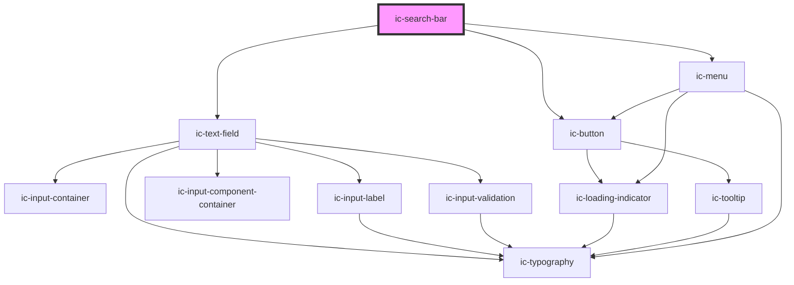

# ic-search-bar

<!-- Auto Generated Below -->

## Properties

| Property                    | Attribute                     | Description                                                                                                                                                                  | Type                                                                                                                                                                                                                                                                                                                                                                                                                                                                                                                                                                                                                                                                                                                                                                                                                                                                                                                        | Default                                                                                                    |
| --------------------------- | ----------------------------- | ---------------------------------------------------------------------------------------------------------------------------------------------------------------------------- | --------------------------------------------------------------------------------------------------------------------------------------------------------------------------------------------------------------------------------------------------------------------------------------------------------------------------------------------------------------------------------------------------------------------------------------------------------------------------------------------------------------------------------------------------------------------------------------------------------------------------------------------------------------------------------------------------------------------------------------------------------------------------------------------------------------------------------------------------------------------------------------------------------------------------- | ---------------------------------------------------------------------------------------------------------- |
| `autocapitalize`            | `autocapitalize`              | The automatic capitalisation of the text value as it is entered/edited by the user. Available options: "off", "none", "on", "sentences", "words", "characters".              | `string`                                                                                                                                                                                                                                                                                                                                                                                                                                                                                                                                                                                                                                                                                                                                                                                                                                                                                                                    | `"off"`                                                                                                    |
| `autocomplete`              | `autocomplete`                | The state of autocompletion the browser can apply on the text value.                                                                                                         | `"name" \| "on" \| "off" \| "honorific-prefix" \| "given-name" \| "additional-name" \| "family-name" \| "honorific-suffix" \| "nickname" \| "email" \| "username" \| "new-password" \| "current-password" \| "one-time-code" \| "organization-title" \| "organization" \| "street-address" \| "address-line1" \| "address-line2" \| "address-line3" \| "address-level4" \| "address-level3" \| "address-level2" \| "address-level1" \| "country" \| "country-name" \| "postal-code" \| "cc-name" \| "cc-given-name" \| "cc-additional-name" \| "cc-family-name" \| "cc-number" \| "cc-exp" \| "cc-exp-month" \| "cc-exp-year" \| "cc-csc" \| "cc-type" \| "transaction-currency" \| "transaction-amount" \| "language" \| "bday" \| "bday-day" \| "bday-month" \| "bday-year" \| "sex" \| "tel" \| "tel-country-code" \| "tel-national" \| "tel-area-code" \| "tel-local" \| "tel-extension" \| "impp" \| "url" \| "photo"` | `"off"`                                                                                                    |
| `autocorrect`               | `autocorrect`                 | The state of autocorrection the browser can apply when the user is entering/editing the text value.                                                                          | `"off" \| "on"`                                                                                                                                                                                                                                                                                                                                                                                                                                                                                                                                                                                                                                                                                                                                                                                                                                                                                                             | `"off"`                                                                                                    |
| `autofocus`                 | `autofocus`                   | If `true`, the form control will have input focus when the page loads.                                                                                                       | `boolean`                                                                                                                                                                                                                                                                                                                                                                                                                                                                                                                                                                                                                                                                                                                                                                                                                                                                                                                   | `false`                                                                                                    |
| `charactersUntilSuggestion` | `characters-until-suggestion` | The number of characters until suggestions appear. The submit button will be disabled until the inputted value is equal to or greater than this number.                      | `number`                                                                                                                                                                                                                                                                                                                                                                                                                                                                                                                                                                                                                                                                                                                                                                                                                                                                                                                    | `2`                                                                                                        |
| `debounce`                  | `debounce`                    | The amount of time, in milliseconds, to wait to trigger the `icChange` event after each keystroke.                                                                           | `number`                                                                                                                                                                                                                                                                                                                                                                                                                                                                                                                                                                                                                                                                                                                                                                                                                                                                                                                    | `0`                                                                                                        |
| `disableFilter`             | `disable-filter`              | Specify whether to disable the built in filtering. For example, if options will already be filtered from external source. If `true`, all options provided will be displayed. | `boolean`                                                                                                                                                                                                                                                                                                                                                                                                                                                                                                                                                                                                                                                                                                                                                                                                                                                                                                                   | `false`                                                                                                    |
| `disabled`                  | `disabled`                    | If `true`, the disabled state will be set.                                                                                                                                   | `boolean`                                                                                                                                                                                                                                                                                                                                                                                                                                                                                                                                                                                                                                                                                                                                                                                                                                                                                                                   | `false`                                                                                                    |
| `emptyOptionListText`       | `empty-option-list-text`      | The text displayed when there are no options in the option list.                                                                                                             | `string`                                                                                                                                                                                                                                                                                                                                                                                                                                                                                                                                                                                                                                                                                                                                                                                                                                                                                                                    | `"No results found"`                                                                                       |
| `focusOnLoad`               | `focus-on-load`               | If `true`, the search bar will be focused when component loaded.                                                                                                             | `boolean`                                                                                                                                                                                                                                                                                                                                                                                                                                                                                                                                                                                                                                                                                                                                                                                                                                                                                                                   | `false`                                                                                                    |
| `fullWidth`                 | `full-width`                  | Specify whether the search bar fills the full width of the container. If `true`, this overrides the --input-width CSS variable.                                              | `boolean`                                                                                                                                                                                                                                                                                                                                                                                                                                                                                                                                                                                                                                                                                                                                                                                                                                                                                                                   | `false`                                                                                                    |
| `helperText`                | `helper-text`                 | The helper text that will be displayed for additional field guidance.                                                                                                        | `string`                                                                                                                                                                                                                                                                                                                                                                                                                                                                                                                                                                                                                                                                                                                                                                                                                                                                                                                    | `""`                                                                                                       |
| `hideLabel`                 | `hide-label`                  | If `true`, the label will be hidden and the required label value will be applied as an aria-label.                                                                           | `boolean`                                                                                                                                                                                                                                                                                                                                                                                                                                                                                                                                                                                                                                                                                                                                                                                                                                                                                                                   | `false`                                                                                                    |
| `hintText`                  | `hint-text`                   | The hint text for the hidden assistive description element.                                                                                                                  | `string`                                                                                                                                                                                                                                                                                                                                                                                                                                                                                                                                                                                                                                                                                                                                                                                                                                                                                                                    | `"When autocomplete results are available use the up and down arrows to choose and press enter to select"` |
| `label` _(required)_        | `label`                       | The label for the search bar.                                                                                                                                                | `string`                                                                                                                                                                                                                                                                                                                                                                                                                                                                                                                                                                                                                                                                                                                                                                                                                                                                                                                    | `undefined`                                                                                                |
| `loading`                   | `loading`                     | Trigger loading state when fetching options asyncronously                                                                                                                    | `boolean`                                                                                                                                                                                                                                                                                                                                                                                                                                                                                                                                                                                                                                                                                                                                                                                                                                                                                                                   | `false`                                                                                                    |
| `loadingErrorLabel`         | `loading-error-label`         | Change the message displayed when external loading times out.                                                                                                                | `string`                                                                                                                                                                                                                                                                                                                                                                                                                                                                                                                                                                                                                                                                                                                                                                                                                                                                                                                    | `"Loading Error"`                                                                                          |
| `loadingLabel`              | `loading-label`               | Change the message displayed whilst the options are being loaded externally.                                                                                                 | `string`                                                                                                                                                                                                                                                                                                                                                                                                                                                                                                                                                                                                                                                                                                                                                                                                                                                                                                                    | `"Loading..."`                                                                                             |
| `name`                      | `name`                        | The name of the control, which is submitted with the form data.                                                                                                              | `string`                                                                                                                                                                                                                                                                                                                                                                                                                                                                                                                                                                                                                                                                                                                                                                                                                                                                                                                    | `this.inputId`                                                                                             |
| `options`                   | --                            | The suggested search options.                                                                                                                                                | `IcMenuOption[]`                                                                                                                                                                                                                                                                                                                                                                                                                                                                                                                                                                                                                                                                                                                                                                                                                                                                                                            | `[]`                                                                                                       |
| `placeholder`               | `placeholder`                 | The placeholder value to display.                                                                                                                                            | `string`                                                                                                                                                                                                                                                                                                                                                                                                                                                                                                                                                                                                                                                                                                                                                                                                                                                                                                                    | `"Search"`                                                                                                 |
| `readonly`                  | `readonly`                    | If `true`, the readonly state will be set.                                                                                                                                   | `boolean`                                                                                                                                                                                                                                                                                                                                                                                                                                                                                                                                                                                                                                                                                                                                                                                                                                                                                                                   | `false`                                                                                                    |
| `required`                  | `required`                    | If `true`, the search bar will require a value.                                                                                                                              | `boolean`                                                                                                                                                                                                                                                                                                                                                                                                                                                                                                                                                                                                                                                                                                                                                                                                                                                                                                                   | `false`                                                                                                    |
| `small`                     | `small`                       | If `true`, the small styling will be applied to the search bar.                                                                                                              | `boolean`                                                                                                                                                                                                                                                                                                                                                                                                                                                                                                                                                                                                                                                                                                                                                                                                                                                                                                                   | `false`                                                                                                    |
| `spellcheck`                | `spellcheck`                  | If `true`, the value of the search will have its spelling and grammar checked.                                                                                               | `boolean`                                                                                                                                                                                                                                                                                                                                                                                                                                                                                                                                                                                                                                                                                                                                                                                                                                                                                                                   | `false`                                                                                                    |
| `timeout`                   | `timeout`                     | If using external filtering, set a timeout for when loading takes too long.                                                                                                  | `number`                                                                                                                                                                                                                                                                                                                                                                                                                                                                                                                                                                                                                                                                                                                                                                                                                                                                                                                    | `undefined`                                                                                                |
| `value`                     | `value`                       | The value of the search input.                                                                                                                                               | `string`                                                                                                                                                                                                                                                                                                                                                                                                                                                                                                                                                                                                                                                                                                                                                                                                                                                                                                                    | `""`                                                                                                       |

## Events

| Event              | Description                                                                                                                    | Type                                      |
| ------------------ | ------------------------------------------------------------------------------------------------------------------------------ | ----------------------------------------- |
| `icChange`         | Emitted when the value has changed.                                                                                            | `CustomEvent<IcValueEventDetail>`         |
| `icClear`          | Emitted when value is cleared with clear button                                                                                | `CustomEvent<void>`                       |
| `icInput`          | Emitted when a keyboard input occurred.                                                                                        | `CustomEvent<IcValueEventDetail>`         |
| `icInputBlur`      | **[DEPRECATED]** This event should not be used anymore. Use icSearchBarBlur instead.    | `CustomEvent<IcSearchBarBlurEventDetail>` |
| `icInputFocus`     | **[DEPRECATED]** This event should not be used anymore. Use icSearchBarFocus instead.   | `CustomEvent<IcValueEventDetail>`         |
| `icMenuChange`     | Emitted when the state of the menu changes (i.e. open or close)                                                                | `CustomEvent<IcMenuChangeEventDetail>`    |
| `icOptionSelect`   | Emitted when option is highlighted within the menu                                                                             | `CustomEvent<IcOptionSelectEventDetail>`  |
| `icRetryLoad`      | Emitted when the 'retry loading' button is clicked                                                                             | `CustomEvent<IcValueEventDetail>`         |
| `icSearchBarBlur`  | Emitted when blur is invoked from ic-search-bar                                                                                | `CustomEvent<IcSearchBarBlurEventDetail>` |
| `icSearchBarFocus` | Emitted when focus is invoked from ic-search-bar                                                                               | `CustomEvent<void>`                       |
| `icSubmitSearch`   | Emitted when the search value has been submitted                                                                               | `CustomEvent<IcValueEventDetail>`         |

## Methods

### `setFocus() => Promise<void>`

Sets focus on the native `input`.

#### Returns

Type: `Promise<void>`

## CSS Custom Properties

| Name                | Description                |
| ------------------- | -------------------------- |
| `--ic-z-index-menu` | z-index of search bar menu |

## Dependencies

### Depends on

- [ic-text-field](../ic-text-field)
- [ic-button](../ic-button)
- [ic-menu](../ic-menu)

### Graph

----------------------------------------------

