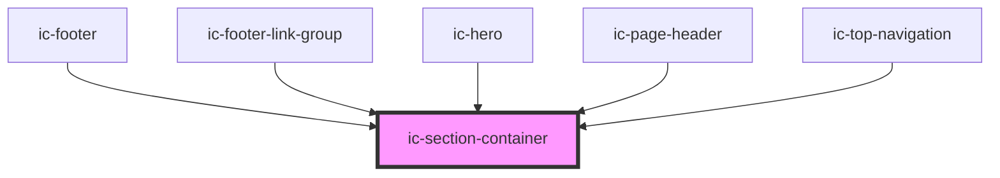

# ic-section-container

<!-- Auto Generated Below -->

## Properties

| Property     | Attribute     | Description                                               | Type                                 | Default  |
| ------------ | ------------- | --------------------------------------------------------- | ------------------------------------ | -------- |
| `aligned`    | `aligned`     | How the container should be aligned.                      | `"center" \| "full-width" \| "left"` | `"left"` |
| `fullHeight` | `full-height` | Removes the standard vertical padding from the container. | `boolean`                            | `false`  |

## Dependencies

### Used by

 - [ic-footer](../ic-footer)
 - [ic-footer-link-group](../ic-footer-link-group)
 - [ic-hero](../ic-hero)
 - [ic-page-header](../ic-page-header)
 - [ic-top-navigation](../ic-top-navigation)

### Graph

----------------------------------------------

