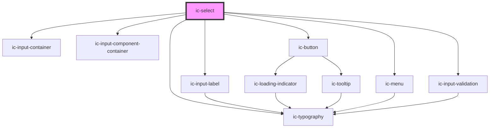

# ic-select

<!-- Auto Generated Below -->

## Properties

| Property                      | Attribute                        | Description                                                                                                                                        | Type                                      | Default              |
| ----------------------------- | -------------------------------- | -------------------------------------------------------------------------------------------------------------------------------------------------- | ----------------------------------------- | -------------------- |
| `charactersUntilSuggestions`  | `characters-until-suggestions`   | **[DEPRECATED]** This prop should not be used anymore.                                                      | `number`                                  | `0`                  |
| `debounce`                    | `debounce`                       | The amount of time, in milliseconds, to wait to trigger the `icChange` event after each keystroke.                                                 | `number`                                  | `0`                  |
| `disableFilter`               | `disable-filter`                 | Specify whether to disable the built in filtering for a searchable variant. For example, if options will already be filtered from external source. | `boolean`                                 | `false`              |
| `disabled`                    | `disabled`                       | If `true`, the disabled state will be set.                                                                                                         | `boolean`                                 | `false`              |
| `emptyOptionListText`         | `empty-option-list-text`         | The text displayed when there are no options in the option list.                                                                                   | `string`                                  | `"No results found"` |
| `fullWidth`                   | `full-width`                     | If `true`, the select element will fill the width of the container.                                                                                | `boolean`                                 | `false`              |
| `helperText`                  | `helper-text`                    | The helper text that will be displayed for additional field guidance.                                                                              | `string`                                  | `""`                 |
| `hideLabel`                   | `hide-label`                     | If `true`, the label will be hidden and the required label value will be applied as an aria-label.                                                 | `boolean`                                 | `false`              |
| `includeDescriptionsInSearch` | `include-descriptions-in-search` | If `true`, descriptions of options will be included when filtering options in a searchable select. Only applies to built in filtering.             | `boolean`                                 | `false`              |
| `includeGroupTitlesInSearch`  | `include-group-titles-in-search` | If `true`, group titles of grouped options will be included when filtering options in a searchable select. Only applies to built in filtering.     | `boolean`                                 | `false`              |
| `label` _(required)_          | `label`                          | The label for the select.                                                                                                                          | `string`                                  | `undefined`          |
| `name`                        | `name`                           | The name of the control, which is submitted with the form data.                                                                                    | `string`                                  | `this.inputId`       |
| `options`                     | --                               | The possible selection options.                                                                                                                    | `IcMenuOption[]`                          | `[]`                 |
| `placeholder`                 | `placeholder`                    | The placeholder value to be displayed.                                                                                                             | `string`                                  | `"Select an option"` |
| `readonly`                    | `readonly`                       | If `true`, the readonly state will be set.                                                                                                         | `boolean`                                 | `false`              |
| `required`                    | `required`                       | If `true`, the select will require a value.                                                                                                        | `boolean`                                 | `false`              |
| `searchMatchPosition`         | `search-match-position`          | Whether the search string of the searchable select should match the start of or anywhere in the options. Only applies to built in filtering.       | `"anywhere" \| "start"`                   | `"anywhere"`         |
| `searchable`                  | `searchable`                     | If `true`, a searchable variant of the select will be displayed which can be typed in to filter options.                                           | `boolean`                                 | `false`              |
| `showClearButton`             | `show-clear-button`              | If `true`, a button which clears the select input when clicked will be displayed. The button will always appear on the searchable select.          | `boolean`                                 | `false`              |
| `small`                       | `small`                          | If `true`, the small styling will be applied to the select.                                                                                        | `boolean`                                 | `false`              |
| `validationStatus`            | `validation-status`              | The validation status - e.g. 'error' \| 'warning' \| 'success'.                                                                                    | `"" \| "error" \| "success" \| "warning"` | `""`                 |
| `validationText`              | `validation-text`                | The text to display as the validation message.                                                                                                     | `string`                                  | `""`                 |
| `value`                       | `value`                          | The value of the currently selected option.                                                                                                        | `string`                                  | `undefined`          |

## Events

| Event            | Description                                                                                                                                        | Type                                     |
| ---------------- | -------------------------------------------------------------------------------------------------------------------------------------------------- | ---------------------------------------- |
| `icBlur`         | Emitted when select loses focus.                                                                                                                   | `CustomEvent<void>`                      |
| `icChange`       | Emitted when the value changes.                                                                                                                    | `CustomEvent<IcValueEventDetail>`        |
| `icClear`        | Emitted when clear button clicked.                                                                                                                 | `CustomEvent<void>`                      |
| `icFocus`        | Emitted when select gains focus.                                                                                                                   | `CustomEvent<void>`                      |
| `icInput`        | Emitted when a keyboard input occurred.                                                                                                            | `CustomEvent<IcValueEventDetail>`        |
| `icOptionSelect` | Emitted when option is highlighted within the menu. Highlighting a menu item will trigger an `icChange/onIcChange` due to the value being updated. | `CustomEvent<IcOptionSelectEventDetail>` |

## Methods

### `setFocus() => Promise<void>`

Sets focus on the input box.

#### Returns

Type: `Promise<void>`

## CSS Custom Properties

| Name                | Description              |
| ------------------- | ------------------------ |
| `--ic-z-index-menu` | z-index of select menu   |
| `--input-width`     | Width of the input field |

## Dependencies

### Depends on

- [ic-input-container](../ic-input-container)
- [ic-input-label](../ic-input-label)
- [ic-input-component-container](../ic-input-component-container)
- [ic-typography](../ic-typography)
- [ic-button](../ic-button)
- [ic-menu](../ic-menu)
- [ic-input-validation](../ic-input-validation)

### Graph

----------------------------------------------

