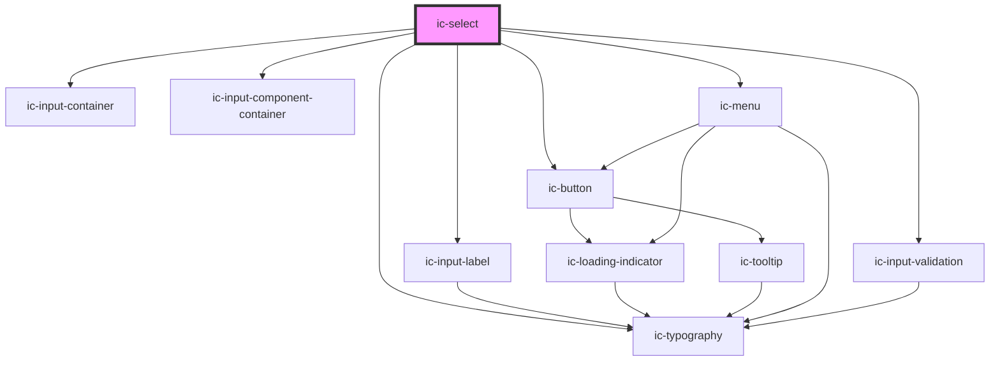

# ic-select

<!-- Auto Generated Below -->

## Properties

| Property                      | Attribute                        | Description                                                                                                                                                                                                                             | Type                                      | Default              |
| ----------------------------- | -------------------------------- | --------------------------------------------------------------------------------------------------------------------------------------------------------------------------------------------------------------------------------------- | ----------------------------------------- | -------------------- |
| `debounce`                    | `debounce`                       | The amount of time, in milliseconds, to wait to trigger the `icInput` event after each keystroke.                                                                                                                                       | `number`                                  | `0`                  |
| `disableAutoFiltering`        | `disable-auto-filtering`         | If `true`, the built in filtering will be disabled for a searchable variant. For example, if options will already be filtered from external source.                                                                                     | `boolean`                                 | `false`              |
| `disabled`                    | `disabled`                       | If `true`, the disabled state will be set.                                                                                                                                                                                              | `boolean`                                 | `false`              |
| `emptyOptionListText`         | `empty-option-list-text`         | The text displayed when there are no options in the option list.                                                                                                                                                                        | `string`                                  | `"No results found"` |
| `form`                        | `form`                           | The <form> element to associate the select with.                                                                                                                                                                                        | `string`                                  | `undefined`          |
| `fullWidth`                   | `full-width`                     | If `true`, the select will fill the width of the container.                                                                                                                                                                             | `boolean`                                 | `false`              |
| `helperText`                  | `helper-text`                    | The helper text that will be displayed for additional field guidance.                                                                                                                                                                   | `string`                                  | `""`                 |
| `hideLabel`                   | `hide-label`                     | If `true`, the label will be hidden and the required label value will be applied as an aria-label.                                                                                                                                      | `boolean`                                 | `false`              |
| `includeDescriptionsInSearch` | `include-descriptions-in-search` | If `true`, descriptions of options will be included when filtering options in a searchable select. Only applies to built in filtering.                                                                                                  | `boolean`                                 | `false`              |
| `includeGroupTitlesInSearch`  | `include-group-titles-in-search` | If `true`, group titles of grouped options will be included when filtering options in a searchable select. Only applies to built in filtering.                                                                                          | `boolean`                                 | `false`              |
| `label` _(required)_          | `label`                          | The label for the select.                                                                                                                                                                                                               | `string`                                  | `undefined`          |
| `loading`                     | `loading`                        | If `true`, the loading state will be triggered when fetching options asynchronously.                                                                                                                                                    | `boolean`                                 | `false`              |
| `loadingErrorLabel`           | `loading-error-label`            | The message displayed when external loading times out.                                                                                                                                                                                  | `string`                                  | `"Loading Error"`    |
| `loadingLabel`                | `loading-label`                  | The message displayed whilst the options are being loaded externally.                                                                                                                                                                   | `string`                                  | `"Loading..."`       |
| `multiple`                    | `multiple`                       | If `true`, multiple options can be selected.                                                                                                                                                                                            | `boolean`                                 | `false`              |
| `name`                        | `name`                           | The name of the control, which is submitted with the form data.                                                                                                                                                                         | `string`                                  | `this.inputId`       |
| `options`                     | --                               | The possible selection options.                                                                                                                                                                                                         | `IcMenuOption[]`                          | `[]`                 |
| `placeholder`                 | `placeholder`                    | The placeholder value to be displayed.                                                                                                                                                                                                  | `string`                                  | `"Select an option"` |
| `readonly`                    | `readonly`                       | If `true`, the readonly state will be set.                                                                                                                                                                                              | `boolean`                                 | `false`              |
| `required`                    | `required`                       | If `true`, the select will require a value.                                                                                                                                                                                             | `boolean`                                 | `false`              |
| `searchMatchPosition`         | `search-match-position`          | Whether the search string of the searchable select should match the start of or anywhere in the options. Only applies to built in filtering.                                                                                            | `"anywhere" \| "start"`                   | `"anywhere"`         |
| `searchable`                  | `searchable`                     | If `true`, a searchable variant of the select will be displayed which can be typed in to filter options. This functionality is only available on the single-select variant of the select component.                                     | `boolean`                                 | `false`              |
| `selectOnEnter`               | `select-on-enter`                | If `true`, the icOptionSelect event will be fired on enter instead of ArrowUp and ArrowDown on the single select.                                                                                                                       | `boolean`                                 | `false`              |
| `showClearButton`             | `show-clear-button`              | If `true`, a button which clears the select input when clicked will be displayed. The button will always appear on the searchable select.                                                                                               | `boolean`                                 | `false`              |
| `size`                        | `size`                           | The size of the select.                                                                                                                                                                                                                 | `"large" \| "medium" \| "small"`          | `"medium"`           |
| `theme`                       | `theme`                          | Sets the theme color to the dark or light theme color. "inherit" will set the color based on the system settings or ic-theme component.                                                                                                 | `"dark" \| "inherit" \| "light"`          | `"inherit"`          |
| `timeout`                     | `timeout`                        | If using external filtering, set a timeout for when loading takes too long.                                                                                                                                                             | `number`                                  | `undefined`          |
| `validationStatus`            | `validation-status`              | The validation status - e.g. 'error' \| 'warning' \| 'success'.                                                                                                                                                                         | `"" \| "error" \| "success" \| "warning"` | `""`                 |
| `validationText`              | `validation-text`                | The text to display as the validation message.                                                                                                                                                                                          | `string`                                  | `""`                 |
| `value`                       | `value`                          | The value of the select, reflected by the value of the currently selected option. For the searchable variant, the value is also reflected by the user input. For the multi-select variant, the value must be an array of option values. | `string \| string[]`                      | `undefined`          |

## Events

| Event              | Description                                                                                                                        | Type                                     |
| ------------------ | ---------------------------------------------------------------------------------------------------------------------------------- | ---------------------------------------- |
| `icBlur`           | Emitted when the select loses focus.                                                                                               | `CustomEvent<void>`                      |
| `icChange`         | Emitted when the value changes.                                                                                                    | `CustomEvent<IcValueEventDetail>`        |
| `icClear`          | Emitted when the clear button is clicked.                                                                                          | `CustomEvent<void>`                      |
| `icClose`          | Emitted when the select options menu is closed.                                                                                    | `CustomEvent<void>`                      |
| `icFocus`          | Emitted when the select gains focus.                                                                                               | `CustomEvent<void>`                      |
| `icInput`          | Emitted when a keyboard input occurred.                                                                                            | `CustomEvent<IcValueEventDetail>`        |
| `icOpen`           | Emitted when the select options menu is opened.                                                                                    | `CustomEvent<void>`                      |
| `icOptionDeselect` | Emitted when `multiple` is `true` and an option is deselected.                                                                     | `CustomEvent<IcOptionSelectEventDetail>` |
| `icOptionSelect`   | Emitted when an option is selected. Selecting an option will also trigger an `icChange/onIcChange` due to the value being updated. | `CustomEvent<IcOptionSelectEventDetail>` |
| `icRetryLoad`      | Emitted when the 'retry loading' button is clicked for a searchable variant.                                                       | `CustomEvent<IcValueEventDetail>`        |

## Methods

### `setFocus() => Promise<void>`

Sets focus on the input box.

#### Returns

Type: `Promise<void>`

## Slots

| Slot     | Description                                                  |
| -------- | ------------------------------------------------------------ |
| `"icon"` | Content will be placed to the left of the select text input. |

## CSS Custom Properties

| Name                | Description                |
| ------------------- | -------------------------- |
| `--ic-z-index-menu` | z-index of select menu     |
| `--input-width`     | Width of the input field   |
| `--menu-width`      | Width of the dropdown menu |

## Dependencies

### Depends on

- [ic-input-container](../ic-input-container)
- [ic-input-label](../ic-input-label)
- [ic-input-component-container](../ic-input-component-container)
- [ic-typography](../ic-typography)
- [ic-button](../ic-button)
- [ic-menu](../ic-menu)
- [ic-input-validation](../ic-input-validation)

### Graph

----------------------------------------------

