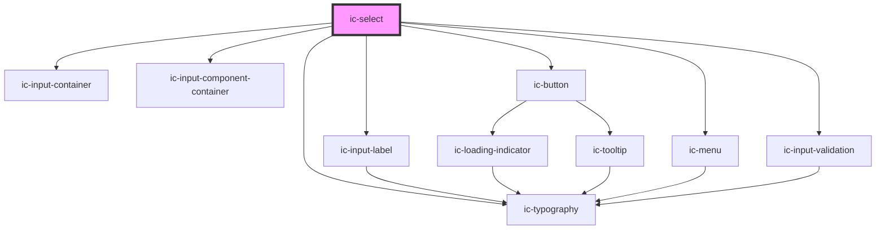

# ic-select

<!-- Auto Generated Below -->

## Properties

| Property                      | Attribute                        | Description                                                                                                   | Type                                      | Default              |
| ----------------------------- | -------------------------------- | ------------------------------------------------------------------------------------------------------------- | ----------------------------------------- | -------------------- |
| `charactersUntilSuggestions`  | `characters-until-suggestions`   | Number of characters until suggestions appear for a searchable select.                                        | `number`                                  | `0`                  |
| `disabled`                    | `disabled`                       | Specify whether the input is disabled.                                                                        | `boolean`                                 | `false`              |
| `emptyOptionListText`         | `empty-option-list-text`         | Provide text for empty results list                                                                           | `string`                                  | `"No results found"` |
| `fullWidth`                   | `full-width`                     | If true, then fill width of container.                                                                        | `boolean`                                 | `false`              |
| `helperText`                  | `helper-text`                    | Provide helper text to display additional field guidance.                                                     | `string`                                  | `""`                 |
| `hideLabel`                   | `hide-label`                     | Hides the label and applies the required label value as an aria-label.                                        | `boolean`                                 | `false`              |
| `includeDescriptionsInSearch` | `include-descriptions-in-search` | If true, descriptions of options are included when filtering options in a searchable select.                  | `boolean`                                 | `false`              |
| `includeGroupTitlesInSearch`  | `include-group-titles-in-search` | If true, group titles of grouped options are included when filtering options in a searchable select.          | `boolean`                                 | `false`              |
| `label` _(required)_          | `label`                          | Provide a label for the input.                                                                                | `string`                                  | `undefined`          |
| `name`                        | `name`                           | The name of the control, which is submitted with the form data.                                               | `string`                                  | `this.inputId`       |
| `options`                     | --                               | Provide the possible selection options.                                                                       | `IcMenuOption[]`                          | `[]`                 |
| `placeholder`                 | `placeholder`                    | Provide a placeholder value to display.                                                                       | `string`                                  | `"Select an option"` |
| `readonly`                    | `readonly`                       | Specify whether the input is read only.                                                                       | `boolean`                                 | `false`              |
| `required`                    | `required`                       | Specify if the input requires a value.                                                                        | `boolean`                                 | `false`              |
| `searchMatchPosition`         | `search-match-position`          | Whether the search string of the searchable select should match the start of or anywhere in the options.      | `"anywhere" \| "start"`                   | `"anywhere"`         |
| `searchable`                  | `searchable`                     | If true, the select can be typed in to filter options.                                                        | `boolean`                                 | `false`              |
| `showClearButton`             | `show-clear-button`              | Display a button which clears the input when clicked. The button will always appear on the searchable select. | `boolean`                                 | `false`              |
| `small`                       | `small`                          | Specify whether small styling is to be applied to the element.                                                | `boolean`                                 | `false`              |
| `validationStatus`            | `validation-status`              | Provide a validation status.                                                                                  | `"" \| "error" \| "success" \| "warning"` | `""`                 |
| `validationText`              | `validation-text`                | Provide the text to display as the validation message.                                                        | `string`                                  | `""`                 |
| `value`                       | `value`                          | The value of the currently selected option.                                                                   | `string`                                  | `undefined`          |

## Events

| Event      | Description                       | Type                              |
| ---------- | --------------------------------- | --------------------------------- |
| `icBlur`   | Emitted when select has blur.     | `CustomEvent<void>`               |
| `icChange` | Emitted when a value is selected. | `CustomEvent<IcValueEventDetail>` |
| `icFocus`  | Emitted when select has focus.    | `CustomEvent<void>`               |

## Methods

### `setFocus() => Promise<void>`

Sets focus on the input box.

#### Returns

Type: `Promise<void>`

## CSS Custom Properties

| Name            | Description              |
| --------------- | ------------------------ |
| `--input-width` | Width of the input field |

## Dependencies

### Depends on

- [ic-input-container](../ic-input-container)
- [ic-input-label](../ic-input-label)
- [ic-input-component-container](../ic-input-component-container)
- [ic-typography](../ic-typography)
- [ic-button](../ic-button)
- [ic-menu](../ic-menu)
- [ic-input-validation](../ic-input-validation)

### Graph

----------------------------------------------

