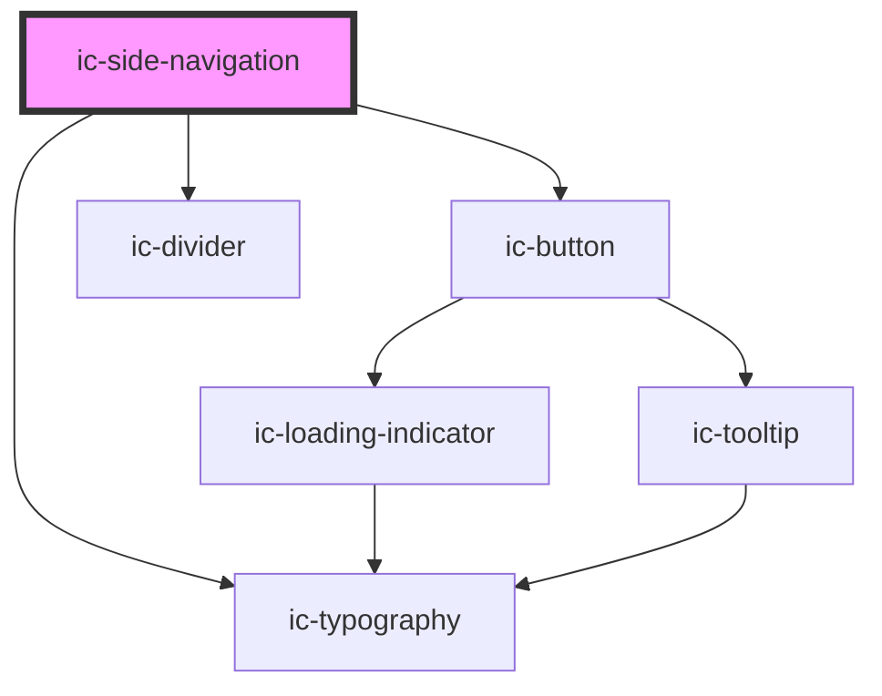

# ic-side-navigation

<!-- Auto Generated Below -->

## Properties

| Property                   | Attribute                     | Description                                                                                                 | Type      | Default     |
| -------------------------- | ----------------------------- | ----------------------------------------------------------------------------------------------------------- | --------- | ----------- |
| `appTitle` _(required)_    | `app-title`                   | Title to display.                                                                                           | `string`  | `undefined` |
| `collapsedIconLabels`      | `collapsed-icon-labels`       | If true, the icon and label will appear when side navigation is collapsed                                   | `boolean` | `false`     |
| `disableAutoParentStyling` | `disable-auto-parent-styling` | If true, disable automatic parent wrapper styling                                                           | `boolean` | `false`     |
| `expanded`                 | `expanded`                    | If true, the ic-side-navigation will load in an expanded state                                              | `boolean` | `false`     |
| `href`                     | `href`                        | Set application title link                                                                                  | `string`  | `"/"`       |
| `inline`                   | `inline`                      | If true, side navigation will be contained by parent element                                                | `boolean` | `false`     |
| `static`                   | `static`                      | If true, the menu expand button is removed (PLEASE NOTE: This takes effect on screen sizes 992px and above) | `boolean` | `false`     |
| `status`                   | `status`                      | Status of application                                                                                       | `string`  | `undefined` |
| `version`                  | `version`                     | Version of application                                                                                      | `string`  | `undefined` |

## Slots

| Slot                     | Description                                                                                       |
| ------------------------ | ------------------------------------------------------------------------------------------------- |
| `"app-icon"`             | Content will be rendered adjacent to the application title at the very top of the side navigation |
| `"primary-navigation"`   | Content will be rendered at the top of the side navigation                                        |
| `"secondary-navigation"` | Content will be rendered at the bottom of the side navigation                                     |

## Dependencies

### Depends on

- [ic-typography](../ic-typography)
- [ic-button](../ic-button)
- [ic-divider](../ic-divider)

### Graph

----------------------------------------------

