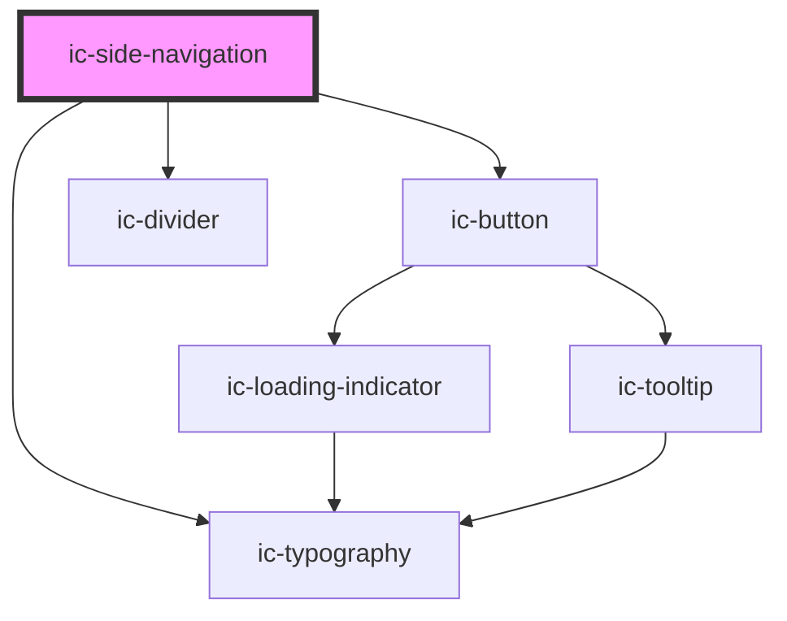

# ic-side-navigation

<!-- Auto Generated Below -->

## Properties

| Property                   | Attribute                     | Description                                                                                                         | Type      | Default     |
| -------------------------- | ----------------------------- | ------------------------------------------------------------------------------------------------------------------- | --------- | ----------- |
| `appTitle`                 | `app-title`                   | The app title to be displayed. This is required, unless a slotted app title link is used.                           | `string`  | `undefined` |
| `collapsedIconLabels`      | `collapsed-icon-labels`       | If `true`, the icon and label will appear when side navigation is collapsed.                                        | `boolean` | `false`     |
| `disableAutoParentStyling` | `disable-auto-parent-styling` | If `true`, automatic parent wrapper styling will be disabled.                                                       | `boolean` | `false`     |
| `expanded`                 | `expanded`                    | If `true`, the side navigation will load in an expanded state.                                                      | `boolean` | `false`     |
| `href`                     | `href`                        | The URL that the app title link points to.                                                                          | `string`  | `"/"`       |
| `shortAppTitle`            | `short-app-title`             | The short title of the app to be displayed at small screen sizes in place of the app title.                         | `string`  | `""`        |
| `static`                   | `static`                      | If `true`, the menu expand button will be removed (PLEASE NOTE: This takes effect on screen sizes 992px and above). | `boolean` | `false`     |
| `status`                   | `status`                      | The status of the app to be displayed.                                                                              | `string`  | `undefined` |
| `version`                  | `version`                     | The version of the app to be displayed.                                                                             | `string`  | `undefined` |

## Slots

| Slot                     | Description                                                                                |
| ------------------------ | ------------------------------------------------------------------------------------------ |
| `"app-icon"`             | Content will be rendered adjacent to the app title at the very top of the side navigation. |
| `"app-title"`            | Handle routing by nesting a route in the app title.                                        |
| `"primary-navigation"`   | Content will be rendered at the top of the side navigation.                                |
| `"secondary-navigation"` | Content will be rendered at the bottom of the side navigation.                             |

## CSS Custom Properties

| Name                           | Description                      |
| ------------------------------ | -------------------------------- |
| `--ic-z-index-side-navigation` | z-index of side navigation panel |

## Dependencies

### Depends on

- [ic-typography](../ic-typography)
- [ic-button](../ic-button)
- [ic-divider](../ic-divider)

### Graph

----------------------------------------------

