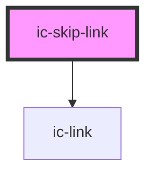

# ic-skip-link

<!-- Auto Generated Below -->

## Properties

| Property                | Attribute                | Description                                                                                                                             | Type                             | Default                  |
| ----------------------- | ------------------------ | --------------------------------------------------------------------------------------------------------------------------------------- | -------------------------------- | ------------------------ |
| `fullWidth`             | `full-width`             | If `true`, the link will fill the width of the page.                                                                                    | `boolean`                        | `false`                  |
| `inline`                | `inline`                 | If `true`, the link will appear inline with surrounding page content when focused.                                                      | `boolean`                        | `false`                  |
| `label`                 | `label`                  | The label displayed when the link is focused.                                                                                           | `string`                         | `"Skip to main content"` |
| `monochrome`            | `monochrome`             | If `true`, the link will display as black in the light theme, and white in the dark theme.                                              | `boolean`                        | `false`                  |
| `target` _(required)_   | `target`                 | The target ID for the element which should receive focus when triggering the skip link.                                                 | `string`                         | `undefined`              |
| `theme`                 | `theme`                  | Sets the theme color to the dark or light theme color. `inherit` will set the color based on the system settings or ic-theme component. | `"dark" \| "inherit" \| "light"` | `"inherit"`              |
| `transparentBackground` | `transparent-background` | If `true`, the background will be hidden.                                                                                               | `boolean`                        | `false`                  |

## Dependencies

### Depends on

- [ic-link](../ic-link)

### Graph

----------------------------------------------

