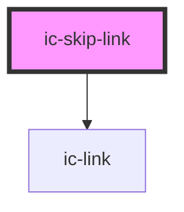

# ic-skip-link

<!-- Auto Generated Below -->

## Properties

| Property                | Attribute                | Description                                                                                                                             | Type                             | Default                  |
| ----------------------- | ------------------------ | --------------------------------------------------------------------------------------------------------------------------------------- | -------------------------------- | ------------------------ |
| `fullWidth`             | `full-width`             | If `true`, the element will fill the width of the container.                                                                            | `boolean`                        | `false`                  |
| `inline`                | `inline`                 | If `true`, the element will appear inline with surrounding page content when focused.                                                   | `boolean`                        | `false`                  |
| `label`                 | `label`                  | The label displayed when the element is focused.                                                                                        | `string`                         | `"Skip to main content"` |
| `monochrome`            | `monochrome`             | If `true`, the link will display as black in the light theme, and white in the dark theme.                                              | `boolean`                        | `false`                  |
| `target`                | `target`                 | The target id for the element which should receive focus when triggering the skip link. Not necessary if using the `router-item` slot.  | `string`                         | `undefined`              |
| `theme`                 | `theme`                  | Sets the theme color to the dark or light theme color. `inherit` will set the color based on the system settings or ic-theme component. | `"dark" \| "inherit" \| "light"` | `"inherit"`              |
| `transparentBackground` | `transparent-background` | Determines whether the background should be hidden.                                                                                     | `boolean`                        | `false`                  |

## Slots

| Slot            | Description                                         |
| --------------- | --------------------------------------------------- |
| `"router-item"` | Handle routing by nesting your routes in this slot. |

## Dependencies

### Depends on

- [ic-link](../ic-link)

### Graph

```mermaid
graph TD;
  ic-skip-link --> ic-link
  style ic-skip-link fill:#f9f,stroke:#333,stroke-width:4px
```

----------------------------------------------

