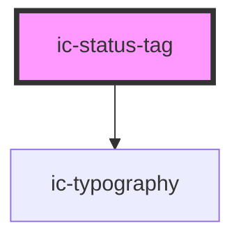

# ic-status-tag

<!-- Auto Generated Below -->

## Properties

| Property             | Attribute   | Description                                                                                                                                                                  | Type                                              | Default     |
| -------------------- | ----------- | ---------------------------------------------------------------------------------------------------------------------------------------------------------------------------- | ------------------------------------------------- | ----------- |
| `announced`          | `announced` | If `true`, role='status' is added to the component and it will act as an 'aria-live' region. Screen readers will announce changes to the `label`, but not the initial value. | `boolean`                                         | `false`     |
| `label` _(required)_ | `label`     | The content rendered within the status tag.                                                                                                                                  | `string`                                          | `undefined` |
| `size`               | `size`      | The size of the status tag component.                                                                                                                                        | `"large" \| "medium" \| "small"`                  | `"medium"`  |
| `status`             | `status`    | The colour of the status tag.                                                                                                                                                | `"danger" \| "neutral" \| "success" \| "warning"` | `"neutral"` |
| `variant`            | `variant`   | The emphasis of the status tag.                                                                                                                                              | `"filled" \| "outlined"`                          | `"filled"`  |

## Dependencies

### Depends on

- [ic-typography](../ic-typography)

### Graph

----------------------------------------------

