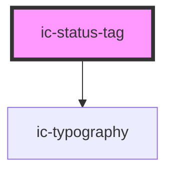

# ic-status-tag

<!-- Auto Generated Below -->

## Properties

| Property             | Attribute    | Description                                                     | Type                                              | Default     |
| -------------------- | ------------ | --------------------------------------------------------------- | ------------------------------------------------- | ----------- |
| `appearance`         | `appearance` | The emphasis of the status tag.                                 | `"filled" \| "outlined"`                          | `"filled"`  |
| `label` _(required)_ | `label`      | The content rendered within the status tag.                     | `string`                                          | `undefined` |
| `small`              | `small`      | If `true`, the small styling will be applied to the status tag. | `boolean`                                         | `false`     |
| `status`             | `status`     | The colour of the status tag.                                   | `"danger" \| "neutral" \| "success" \| "warning"` | `"neutral"` |

## Dependencies

### Depends on

- [ic-typography](../ic-typography)

### Graph

----------------------------------------------

