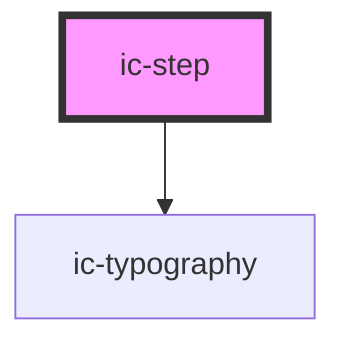

# ic-step

<!-- Auto Generated Below -->

## Properties

| Property       | Attribute       | Description                                | Type                                                 | Default     |
| -------------- | --------------- | ------------------------------------------ | ---------------------------------------------------- | ----------- |
| `stepSubtitle` | `step-subtitle` | The additional information about the step. | `string`                                             | `undefined` |
| `stepTitle`    | `step-title`    | The name of the step within the stepper.   | `string`                                             | `undefined` |
| `stepType`     | `step-type`     | The state of the step within the stepper.  | `"active" \| "completed" \| "current" \| "disabled"` | `"active"`  |

## Dependencies

### Depends on

- [ic-typography](../ic-typography)

### Graph

----------------------------------------------

