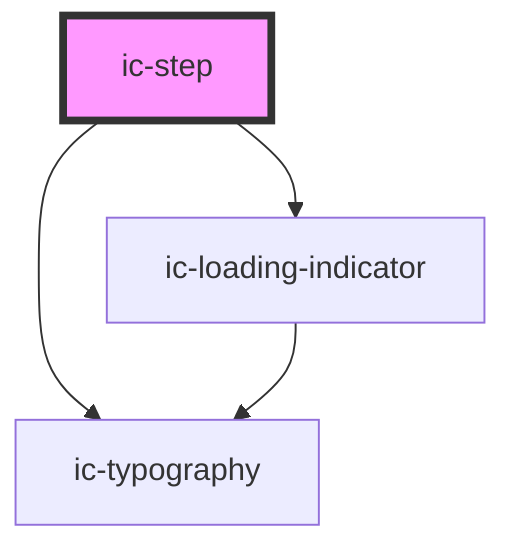

# ic-step

<!-- Auto Generated Below -->

## Properties

| Property       | Attribute       | Description                                                                                                                                             | Type                                                 | Default     |
| -------------- | --------------- | ------------------------------------------------------------------------------------------------------------------------------------------------------- | ---------------------------------------------------- | ----------- |
| `stepStatus`   | `step-status`   | The status of the step. Use this prop to display a status message on the step if it is required or optional.                                            | `"optional" \| "required"`                           | `undefined` |
| `stepSubtitle` | `step-subtitle` | Additional information about the step. Use this prop to override the default step status messaging displayed when selecting a step type or step status. | `string`                                             | `undefined` |
| `stepTitle`    | `step-title`    | The title of the step within the stepper.                                                                                                               | `string`                                             | `undefined` |
| `stepType`     | `step-type`     | The state of the step within the stepper.                                                                                                               | `"active" \| "completed" \| "current" \| "disabled"` | `"active"`  |

## Dependencies

### Depends on

- [ic-loading-indicator](../ic-loading-indicator)
- [ic-typography](../ic-typography)

### Graph

----------------------------------------------

