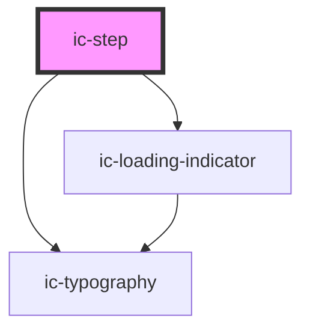

# ic-step

<!-- Auto Generated Below -->

## Properties

| Property     | Attribute    | Description                                                                                                                                             | Type                                                                                                                                                       | Default                                                                                                                                                                                                                   |
| ------------ | ------------ | ------------------------------------------------------------------------------------------------------------------------------------------------------- | ---------------------------------------------------------------------------------------------------------------------------------------------------------- | ------------------------------------------------------------------------------------------------------------------------------------------------------------------------------------------------------------------------- |
| `heading`    | `heading`    | The title of the step within the stepper.                                                                                                               | `string \| undefined`                                                                                                                                      | `undefined`                                                                                                                                                                                                               |
| `icI18n`     | --           | Words within the component that can be replaced to translate the component into a different language                                                    | `{ next: string; step: string; steps: string; of: string; lastStep: string; completed: string; notRequired: string; required: string; optional: string; }` | `{     next: "Next",     step: "Step",     steps: "Steps",     of: "of",     lastStep: "Last step",     completed: "Completed",     notRequired: "Not required",     required: "Required",     optional: "Optional",   }` |
| `status`     | `status`     | The status of the step. Use this prop to display a status message on the step if it is required or optional.                                            | `"optional" \| "required" \| undefined`                                                                                                                    | `undefined`                                                                                                                                                                                                               |
| `subheading` | `subheading` | Additional information about the step. Use this prop to override the default step status messaging displayed when selecting a step type or step status. | `string \| undefined`                                                                                                                                      | `undefined`                                                                                                                                                                                                               |
| `type`       | `type`       | The state of the step within the stepper.                                                                                                               | `"active" \| "completed" \| "current" \| "disabled" \| undefined`                                                                                          | `"active"`                                                                                                                                                                                                                |

## Slots

| Slot        | Description                                            |
| ----------- | ------------------------------------------------------ |
| `"heading"` | Content will be rendered in place of the heading prop. |

## Dependencies

### Depends on

- [ic-loading-indicator](../ic-loading-indicator)
- [ic-typography](../ic-typography)

### Graph

----------------------------------------------

