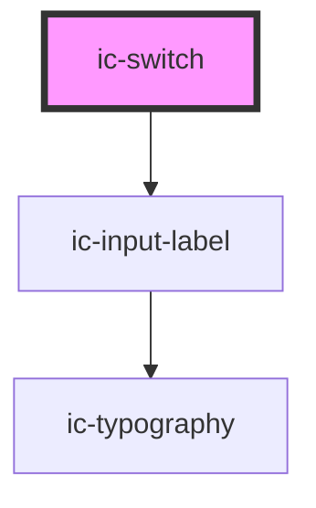

# ic-switch

<!-- Auto Generated Below -->

## Properties

| Property             | Attribute     | Description                                                                                                                                                                                                                                           | Type                                          | Default        |
| -------------------- | ------------- | ----------------------------------------------------------------------------------------------------------------------------------------------------------------------------------------------------------------------------------------------------- | --------------------------------------------- | -------------- |
| `checked`            | `checked`     | If `true`, the switch will display as checked.                                                                                                                                                                                                        | `boolean \| undefined`                        | `false`        |
| `disabled`           | `disabled`    | If `true`, the disabled state will be set.                                                                                                                                                                                                            | `boolean \| undefined`                        | `false`        |
| `helperText`         | `helper-text` | The helper text that will be displayed for additional field guidance.                                                                                                                                                                                 | `string \| undefined`                         | `""`           |
| `hideLabel`          | `hide-label`  | If `true`, the label will be hidden and the required label value will be applied as an aria-label.                                                                                                                                                    | `boolean \| undefined`                        | `false`        |
| `label` _(required)_ | `label`       | The aria-label applied to the switch when no visual 'name' is provided.                                                                                                                                                                               | `string`                                      | `undefined`    |
| `name`               | `name`        | The name of the control, which is submitted with the form data.                                                                                                                                                                                       | `string \| undefined`                         | `this.inputId` |
| `size`               | `size`        | The size of the switch component.                                                                                                                                                                                                                     | `"medium" \| "small" \| undefined`            | `"medium"`     |
| `theme`              | `theme`       | Sets the theme color to the dark or light theme color. "inherit" will set the color based on the system settings or ic-theme component.                                                                                                               | `"dark" \| "inherit" \| "light" \| undefined` | `"inherit"`    |
| `value`              | `value`       | The value of the toggle does not mean if it's checked or not, use the `checked` property for that.  The value of a toggle is analogous to the value of a `<input type="checkbox">`, it's only used when the toggle participates in a native `<form>`. | `null \| string \| undefined`                 | `"on"`         |

## Events

| Event      | Description                                  | Type                                     |
| ---------- | -------------------------------------------- | ---------------------------------------- |
| `icBlur`   | Emitted when the toggle loses focus.         | `CustomEvent<void>`                      |
| `icChange` | Emitted when the value property has changed. | `CustomEvent<IcSwitchChangeEventDetail>` |
| `icFocus`  | Emitted when the toggle has focus.           | `CustomEvent<void>`                      |

## Methods

### `setFocus() => Promise<void>`

Sets focus on the switch.

#### Returns

Type: `Promise<void>`

## Slots

| Slot                | Description                               |
| ------------------- | ----------------------------------------- |
| `"right-adornment"` | Content is placed to the right of switch. |

## Dependencies

### Depends on

- [ic-input-label](../ic-input-label)

### Graph

----------------------------------------------

