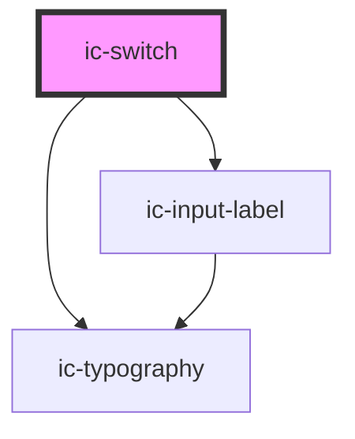

# ic-switch

<!-- Auto Generated Below -->

## Properties

| Property             | Attribute     | Description                                                                                                                                                                                                                                           | Type      | Default        |
| -------------------- | ------------- | ----------------------------------------------------------------------------------------------------------------------------------------------------------------------------------------------------------------------------------------------------- | --------- | -------------- |
| `checked`            | `checked`     | If true, the component is checked, if null the components state will be uncontrolled.                                                                                                                                                                 | `boolean` | `null`         |
| `disabled`           | `disabled`    | If true, the component is not interactive.                                                                                                                                                                                                            | `boolean` | `false`        |
| `helperText`         | `helper-text` | Provide helper text to display additional field guidance.                                                                                                                                                                                             | `string`  | `""`           |
| `hideLabel`          | `hide-label`  | Hides the label and applies the required label value as an aria-label.                                                                                                                                                                                | `boolean` | `false`        |
| `label` _(required)_ | `label`       | Applies an aria-label to the component, for when no visual 'name' is provided.                                                                                                                                                                        | `string`  | `undefined`    |
| `name`               | `name`        | The name of the control, which is submitted with the form data.                                                                                                                                                                                       | `string`  | `this.inputId` |
| `showState`          | `show-state`  | If true, the component will render the On/Off state text.                                                                                                                                                                                             | `boolean` | `false`        |
| `small`              | `small`       | If true, the component reduces in size to the small state.                                                                                                                                                                                            | `boolean` | `false`        |
| `value`              | `value`       | The value of the toggle does not mean if it's checked or not, use the `checked` property for that.  The value of a toggle is analogous to the value of a `<input type="checkbox">`, it's only used when the toggle participates in a native `<form>`. | `string`  | `"on"`         |

## Events

| Event      | Description                                  | Type                                     |
| ---------- | -------------------------------------------- | ---------------------------------------- |
| `icBlur`   | Emitted when the toggle loses focus.         | `CustomEvent<void>`                      |
| `icChange` | Emitted when the value property has changed. | `CustomEvent<IcSwitchChangeEventDetail>` |
| `icFocus`  | Emitted when the toggle has focus.           | `CustomEvent<void>`                      |

## Slots

| Slot                | Description                                                  |
| ------------------- | ------------------------------------------------------------ |
| `"right-adornment"` | Content is placed to the right of switch before state label. |

## Dependencies

### Depends on

- [ic-input-label](../ic-input-label)
- [ic-typography](../ic-typography)

### Graph

----------------------------------------------

