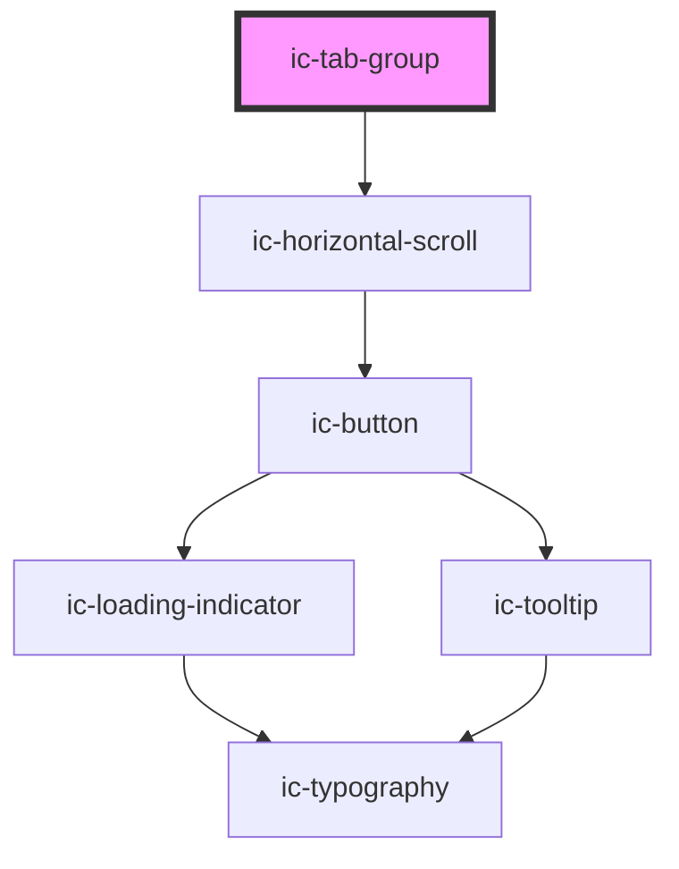

# ic-tab-group

<!-- Auto Generated Below -->

## Properties

| Property             | Attribute    | Description                                                                                                                | Type      | Default     |
| -------------------- | ------------ | -------------------------------------------------------------------------------------------------------------------------- | --------- | ----------- |
| `contextId`          | `context-id` | The unique context needed if using multiple tabs inside one another i.e. rendering another set of tabs inside a tab panel. | `string`  | `"default"` |
| `inline`             | `inline`     | If `true`, the tabs and tab panels will be positioned separately.                                                          | `boolean` | `false`     |
| `label` _(required)_ | `label`      | The label to describe the purpose of the set of tabs to screen reader users.                                               | `string`  | `undefined` |

## Dependencies

### Depends on

- [ic-horizontal-scroll](../ic-horizontal-scroll)

### Graph

----------------------------------------------

