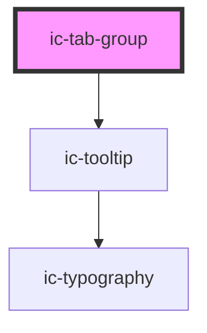

# ic-tab-group

<!-- Auto Generated Below -->

## Properties

| Property             | Attribute    | Description                                                                                                               | Type      | Default     |
| -------------------- | ------------ | ------------------------------------------------------------------------------------------------------------------------- | --------- | ----------- |
| `contextId`          | `context-id` | Provide a unique context if using multiple tabs inside one another i.e. rendering another set of tabs inside a tab panel. | `string`  | `"default"` |
| `inline`             | `inline`     | Use when tabs and tab panels are to be positioned separately.                                                             | `boolean` | `false`     |
| `label` _(required)_ | `label`      | Provide a label to describe the purpose of the set of tabs to screen reader users.                                        | `string`  | `undefined` |

## Dependencies

### Depends on

- [ic-tooltip](../ic-tooltip)

### Graph

----------------------------------------------

