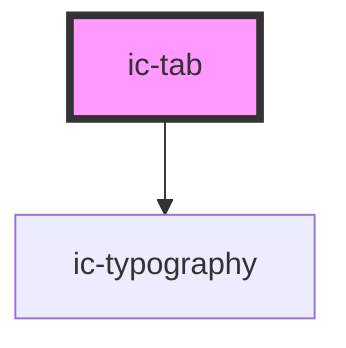

# ic-tab

<!-- Auto Generated Below -->

## Properties

| Property   | Attribute  | Description                                | Type      | Default |
| ---------- | ---------- | ------------------------------------------ | --------- | ------- |
| `disabled` | `disabled` | If `true`, the disabled state will be set. | `boolean` | `false` |

## Events

| Event        | Description                                | Type                                 |
| ------------ | ------------------------------------------ | ------------------------------------ |
| `tabClick`   | Emitted when a tab is selected.            | `CustomEvent<IcTabClickEventDetail>` |
| `tabCreated` | Emitted when a tab is dynamically created. | `CustomEvent<HTMLIcTabElement>`      |
| `tabEnabled` | Emitted when a tab's disabled prop changes | `CustomEvent<void>`                  |
| `tabFocus`   | Emitted when a tab is focussed.            | `CustomEvent<IcTabClickEventDetail>` |
| `tabRemoved` | Emitted when a tab is unmounted.           | `CustomEvent<void>`                  |

## Methods

### `setFocus() => Promise<void>`

Sets focus on the tab.

#### Returns

Type: `Promise<void>`

## Slots

| Slot      | Description                                     |
| --------- | ----------------------------------------------- |
| `"badge"` | Badge component displayed inline with the tab.  |
| `"icon"`  | Content will be rendered next to the tab label. |

## Dependencies

### Depends on

- [ic-typography](../ic-typography)

### Graph

----------------------------------------------

