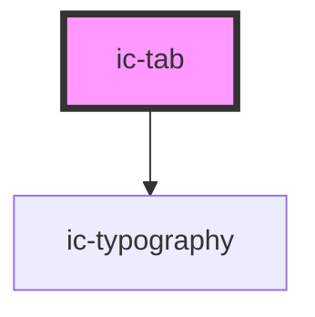

# ic-tab

<!-- Auto Generated Below -->

## Properties

| Property   | Attribute  | Description                                | Type      | Default |
| ---------- | ---------- | ------------------------------------------ | --------- | ------- |
| `disabled` | `disabled` | If `true`, the disabled state will be set. | `boolean` | `false` |

## Slots

| Slot     | Description                                     |
| -------- | ----------------------------------------------- |
| `"icon"` | Content will be rendered next to the tab label. |

## Dependencies

### Depends on

- [ic-typography](../ic-typography)

### Graph

----------------------------------------------

