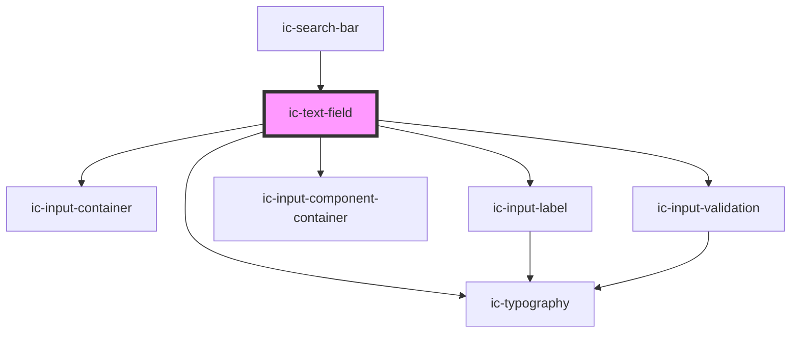

# ic-textfield

<!-- Auto Generated Below -->

## Properties

| Property             | Attribute           | Description                                                                                                                                                                                   | Type                                                                                                                                                                                                                                                                                                                                                                                                                                                                                                                                                                                                                                                                                                                                                                                                                                                                                                                        | Default                               |
| -------------------- | ------------------- | --------------------------------------------------------------------------------------------------------------------------------------------------------------------------------------------- | --------------------------------------------------------------------------------------------------------------------------------------------------------------------------------------------------------------------------------------------------------------------------------------------------------------------------------------------------------------------------------------------------------------------------------------------------------------------------------------------------------------------------------------------------------------------------------------------------------------------------------------------------------------------------------------------------------------------------------------------------------------------------------------------------------------------------------------------------------------------------------------------------------------------------- | ------------------------------------- |
| `autoFocus`          | `auto-focus`        | This Boolean attribute lets you specify that a form control should have input focus when the page loads.                                                                                      | `boolean`                                                                                                                                                                                                                                                                                                                                                                                                                                                                                                                                                                                                                                                                                                                                                                                                                                                                                                                   | `false`                               |
| `autocapitalize`     | `autocapitalize`    | Indicates whether and how the text value should be automatically capitalized as it is entered/edited by the user. Available options: "off", "none", "on", "sentences", "words", "characters". | `string`                                                                                                                                                                                                                                                                                                                                                                                                                                                                                                                                                                                                                                                                                                                                                                                                                                                                                                                    | `"off"`                               |
| `autocomplete`       | `autocomplete`      | Indicates whether the value of the control can be automatically completed by the browser.                                                                                                     | `"name" \| "on" \| "off" \| "honorific-prefix" \| "given-name" \| "additional-name" \| "family-name" \| "honorific-suffix" \| "nickname" \| "email" \| "username" \| "new-password" \| "current-password" \| "one-time-code" \| "organization-title" \| "organization" \| "street-address" \| "address-line1" \| "address-line2" \| "address-line3" \| "address-level4" \| "address-level3" \| "address-level2" \| "address-level1" \| "country" \| "country-name" \| "postal-code" \| "cc-name" \| "cc-given-name" \| "cc-additional-name" \| "cc-family-name" \| "cc-number" \| "cc-exp" \| "cc-exp-month" \| "cc-exp-year" \| "cc-csc" \| "cc-type" \| "transaction-currency" \| "transaction-amount" \| "language" \| "bday" \| "bday-day" \| "bday-month" \| "bday-year" \| "sex" \| "tel" \| "tel-country-code" \| "tel-national" \| "tel-area-code" \| "tel-local" \| "tel-extension" \| "impp" \| "url" \| "photo"` | `"off"`                               |
| `autocorrect`        | `autocorrect`       | Whether auto correction should be enabled when the user is entering/editing the text value.                                                                                                   | `"off" \| "on"`                                                                                                                                                                                                                                                                                                                                                                                                                                                                                                                                                                                                                                                                                                                                                                                                                                                                                                             | `"off"`                               |
| `debounce`           | `debounce`          | Set the amount of time, in milliseconds, to wait to trigger the `icChange` event after each keystroke.                                                                                        | `number`                                                                                                                                                                                                                                                                                                                                                                                                                                                                                                                                                                                                                                                                                                                                                                                                                                                                                                                    | `0`                                   |
| `disabled`           | `disabled`          | Specify whether the input is disabled.                                                                                                                                                        | `boolean`                                                                                                                                                                                                                                                                                                                                                                                                                                                                                                                                                                                                                                                                                                                                                                                                                                                                                                                   | `false`                               |
| `fullWidth`          | `full-width`        | Specify whether the component fills the full width of the container. If true, this overrides the --input-width css prop.                                                                      | `boolean`                                                                                                                                                                                                                                                                                                                                                                                                                                                                                                                                                                                                                                                                                                                                                                                                                                                                                                                   | `false`                               |
| `helperText`         | `helper-text`       | Provide helper text to display additional field guidance.                                                                                                                                     | `string`                                                                                                                                                                                                                                                                                                                                                                                                                                                                                                                                                                                                                                                                                                                                                                                                                                                                                                                    | `""`                                  |
| `hideLabel`          | `hide-label`        | Hides the label and applies the required label value as an aria-label.                                                                                                                        | `boolean`                                                                                                                                                                                                                                                                                                                                                                                                                                                                                                                                                                                                                                                                                                                                                                                                                                                                                                                   | `false`                               |
| `inputId`            | `input-id`          | Provide an id for the input                                                                                                                                                                   | `string`                                                                                                                                                                                                                                                                                                                                                                                                                                                                                                                                                                                                                                                                                                                                                                                                                                                                                                                    | ``ic-text-field-input-${inputIds++}`` |
| `inputmode`          | `inputmode`         | A hint to the browser for which keyboard to display. Possible values: `"none"`, `"text"`, `"tel"`, `"url"`, `"email"`, `"numeric"`, `"decimal"`, and `"search"`.                              | `"decimal" \| "email" \| "none" \| "numeric" \| "search" \| "tel" \| "text" \| "url"`                                                                                                                                                                                                                                                                                                                                                                                                                                                                                                                                                                                                                                                                                                                                                                                                                                       | `"text"`                              |
| `label` _(required)_ | `label`             | Provide a label for the input.                                                                                                                                                                | `string`                                                                                                                                                                                                                                                                                                                                                                                                                                                                                                                                                                                                                                                                                                                                                                                                                                                                                                                    | `undefined`                           |
| `maxLength`          | `max-length`        | Maximum number of characters that can be entered in the field.                                                                                                                                | `number`                                                                                                                                                                                                                                                                                                                                                                                                                                                                                                                                                                                                                                                                                                                                                                                                                                                                                                                    | `0`                                   |
| `name`               | `name`              | The name of the control, which is submitted with the form data.                                                                                                                               | `string`                                                                                                                                                                                                                                                                                                                                                                                                                                                                                                                                                                                                                                                                                                                                                                                                                                                                                                                    | `this.inputId`                        |
| `placeholder`        | `placeholder`       | Provide a placeholder value to display.                                                                                                                                                       | `string`                                                                                                                                                                                                                                                                                                                                                                                                                                                                                                                                                                                                                                                                                                                                                                                                                                                                                                                    | `""`                                  |
| `readonly`           | `readonly`          | Specify whether the input is read only.                                                                                                                                                       | `boolean`                                                                                                                                                                                                                                                                                                                                                                                                                                                                                                                                                                                                                                                                                                                                                                                                                                                                                                                   | `false`                               |
| `required`           | `required`          | Specify if the input requires a value.                                                                                                                                                        | `boolean`                                                                                                                                                                                                                                                                                                                                                                                                                                                                                                                                                                                                                                                                                                                                                                                                                                                                                                                   | `false`                               |
| `resize`             | `resize`            | Allow resizing of a multiline text area                                                                                                                                                       | `boolean`                                                                                                                                                                                                                                                                                                                                                                                                                                                                                                                                                                                                                                                                                                                                                                                                                                                                                                                   | `false`                               |
| `rows`               | `rows`              | Specify the number of rows to transform the text field into a text area with a specific height.                                                                                               | `number`                                                                                                                                                                                                                                                                                                                                                                                                                                                                                                                                                                                                                                                                                                                                                                                                                                                                                                                    | `1`                                   |
| `small`              | `small`             | Specify whether small styling is to be applied to the element.                                                                                                                                | `boolean`                                                                                                                                                                                                                                                                                                                                                                                                                                                                                                                                                                                                                                                                                                                                                                                                                                                                                                                   | `false`                               |
| `spellcheck`         | `spellcheck`        | If `true`, the element will have its spelling and grammar checked.                                                                                                                            | `boolean`                                                                                                                                                                                                                                                                                                                                                                                                                                                                                                                                                                                                                                                                                                                                                                                                                                                                                                                   | `false`                               |
| `type`               | `type`              | The type of control to display. The default type is text.                                                                                                                                     | `"email" \| "number" \| "password" \| "search" \| "tel" \| "text" \| "url"`                                                                                                                                                                                                                                                                                                                                                                                                                                                                                                                                                                                                                                                                                                                                                                                                                                                 | `"text"`                              |
| `validationInline`   | `validation-inline` | Show icon in input control - only applies when validationStatus ='success'                                                                                                                    | `boolean`                                                                                                                                                                                                                                                                                                                                                                                                                                                                                                                                                                                                                                                                                                                                                                                                                                                                                                                   | `false`                               |
| `validationStatus`   | `validation-status` | Provide validation state - 'error' \| 'warning' \| 'success'                                                                                                                                  | `"" \| "error" \| "success" \| "warning"`                                                                                                                                                                                                                                                                                                                                                                                                                                                                                                                                                                                                                                                                                                                                                                                                                                                                                   | `""`                                  |
| `validationText`     | `validation-text`   | Provide validation state - 'error' \| 'warning' \| 'success'                                                                                                                                  | `string`                                                                                                                                                                                                                                                                                                                                                                                                                                                                                                                                                                                                                                                                                                                                                                                                                                                                                                                    | `""`                                  |
| `value`              | `value`             | Value of TextField.                                                                                                                                                                           | `string`                                                                                                                                                                                                                                                                                                                                                                                                                                                                                                                                                                                                                                                                                                                                                                                                                                                                                                                    | `""`                                  |

## Events

| Event       | Description                             | Type                                     |
| ----------- | --------------------------------------- | ---------------------------------------- |
| `icBlur`    | Emitted when input loses focus.         | `CustomEvent<IcValueEventDetail>`        |
| `icChange`  | Emitted when the value has changed.     | `CustomEvent<IcValueEventDetail>`        |
| `icFocus`   | Emitted when input gains focus.         | `CustomEvent<IcValueEventDetail>`        |
| `icInput`   | Emitted when a keyboard input occurred. | `CustomEvent<IcValueEventDetail>`        |
| `icKeydown` | Emitted when a keydown event occurred.  | `CustomEvent<{ event: KeyboardEvent; }>` |

## Methods

### `setFocus() => Promise<void>`

Sets focus on the native `input`

#### Returns

Type: `Promise<void>`

## Slots

| Slot     | Description                                           |
| -------- | ----------------------------------------------------- |
| `"icon"` | Content will be placed to the left of the text input. |

## CSS Custom Properties

| Name            | Description              |
| --------------- | ------------------------ |
| `--input-width` | Width of the input field |

## Dependencies

### Used by

 - [ic-search-bar](../ic-search-bar)

### Depends on

- [ic-input-container](../ic-input-container)
- [ic-input-label](../ic-input-label)
- [ic-input-component-container](../ic-input-component-container)
- [ic-input-validation](../ic-input-validation)
- [ic-typography](../ic-typography)

### Graph

----------------------------------------------

