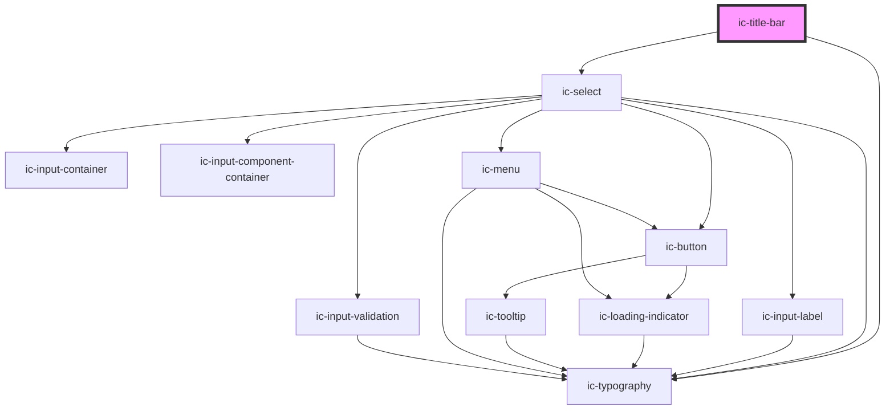

# ic-title-bar

<!-- Auto Generated Below -->

## Properties

| Property            | Attribute             | Description                                                                                                                                                      | Type      | Default     |
| ------------------- | --------------------- | ---------------------------------------------------------------------------------------------------------------------------------------------------------------- | --------- | ----------- |
| `description`       | `description`         | The description that is displayed below the `header` and `metadata`. Can be overridden with the `description` slot.                                              | `string`  | `undefined` |
| `fullWidth`         | `full-width`          | If `true`, will apply a background colour and a bottom border to the title bar.                                                                                  | `boolean` | `true`      |
| `header`            | `header`              | The header of the title bar. Can be overridden with the `header` slot. If used with an ic-data-table it will default to the table's `caption` unless overridden. | `string`  | `undefined` |
| `hideDensitySelect` | `hide-density-select` | When `true`, the density select will not be rendered.                                                                                                            | `boolean` | `false`     |
| `metadata`          | `metadata`            | The metadata displayed next to the `header`.                                                                                                                     | `string`  | `undefined` |

## Events

| Event                  | Description                                             | Type                                      |
| ---------------------- | ------------------------------------------------------- | ----------------------------------------- |
| `icTableDensityUpdate` | Emitted when the table density select value is changed. | `CustomEvent<IcDensityUpdateEventDetail>` |

## Slots

| Slot               | Description                                                                                                   |
| ------------------ | ------------------------------------------------------------------------------------------------------------- |
| `"custom-actions"` | Render additional custom actions to the left of the density select.                                           |
| `"description"`    | Render an alternative description in the description section.                                                 |
| `"header"`         | Render an alternative header in the header section.                                                           |
| `"primary-action"` | Render an interactive element that will perform a primary action. Renders to the right of the density select. |

## Dependencies

### Depends on

- [ic-typography](../ic-typography)
- [ic-select](../ic-select)

### Graph

----------------------------------------------

