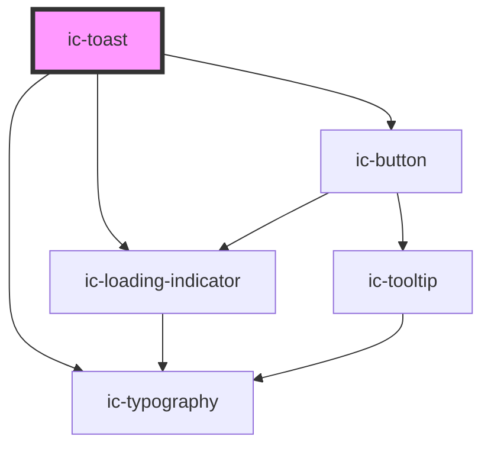

# ic-toast

<!-- Auto Generated Below -->

## Properties

| Property               | Attribute              | Description                                                                                                                                                       | Type                                                       | Default     |
| ---------------------- | ---------------------- | ----------------------------------------------------------------------------------------------------------------------------------------------------------------- | ---------------------------------------------------------- | ----------- |
| `autoDismissTimeout`   | `auto-dismiss-timeout` | If toast dismissMode is set to `automatic`, use this prop to define the time before the toast dismisses (in MILLISECONDS) (NOTE: Has a minimum value of `5000ms`) | `number`                                                   | `5000`      |
| `dismissMode`          | `dismiss-mode`         | How the toast will be dismissed. If manual will display a dismiss button.                                                                                         | `"automatic" \| "manual"`                                  | `"manual"`  |
| `heading` _(required)_ | `heading`              | The title to display at the start of the toast. (NOTE: Should be no more than `70` characters)                                                                    | `string`                                                   | `undefined` |
| `message`              | `message`              | The main body message of the toast. (NOTE: Should be no more than `140` characters)                                                                               | `string`                                                   | `undefined` |
| `neutralAltText`       | `neutral-alt-text`     | If supplying a custom neutral icon, use this prop to set a descriptive alt text                                                                                   | `string`                                                   | `undefined` |
| `variant`              | `variant`              | The variant of the toast being rendered                                                                                                                           | `"error" \| "info" \| "neutral" \| "success" \| "warning"` | `undefined` |

## Events

| Event          | Description                                  | Type                |
| -------------- | -------------------------------------------- | ------------------- |
| `toastDismiss` | Is emitted when the user dismisses the toast | `CustomEvent<void>` |

## Methods

### `setVisible() => Promise<HTMLElement>`

Used to display the individual toast

#### Returns

Type: `Promise<HTMLElement>`

The element that previously had focus before the toast appeared

## Slots

| Slot             | Description                                                       |
| ---------------- | ----------------------------------------------------------------- |
| `"action"`       | IcButton or IcLink is placed below header and message             |
| `"neutral-icon"` | A custom neutral icon is placed on the left side of the component |

## Dependencies

### Depends on

- [ic-typography](../ic-typography)
- [ic-loading-indicator](../ic-loading-indicator)
- [ic-button](../ic-button)

### Graph

----------------------------------------------

