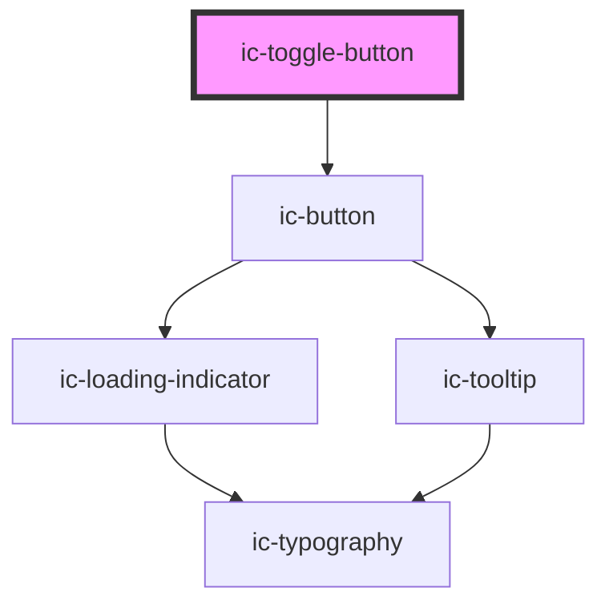

# ic-toggle-button

<!-- Auto Generated Below -->

## Properties

| Property          | Attribute          | Description                                                                                                              | Type                              | Default     |
| ----------------- | ------------------ | ------------------------------------------------------------------------------------------------------------------------ | --------------------------------- | ----------- |
| `accessibleLabel` | `accessible-label` | The accessible label that will be applied to the toggle button. This is required for the icon variant of toggle buttons. | `string`                          | `undefined` |
| `appearance`      | `appearance`       | The appearance of the toggle button.                                                                                     | `"dark" \| "default" \| "light"`  | `"default"` |
| `checked`         | `checked`          | If `true`, the toggle button will be in a checked state.                                                                 | `boolean`                         | `false`     |
| `disabled`        | `disabled`         | If `true`, the toggle button will be in disabled state.                                                                  | `boolean`                         | `false`     |
| `fullWidth`       | `full-width`       | If `true`, the toggle button will fill the width of the container.                                                       | `boolean`                         | `false`     |
| `iconPlacement`   | `icon-placement`   | The placement of the icon in relation to the toggle button label.                                                        | `"left" \| "right" \| "top"`      | `undefined` |
| `label`           | `label`            | The label to display in the toggle button. This is required for the default variant of toggle buttons.                   | `string`                          | `undefined` |
| `loading`         | `loading`          | If `true`, the toggle button will be in loading state.                                                                   | `boolean`                         | `false`     |
| `size`            | `size`             | The size of the toggle button to be displayed.                                                                           | `"default" \| "large" \| "small"` | `"default"` |
| `variant`         | `variant`          | The variant of the toggle button.                                                                                        | `"default" \| "icon"`             | `"default"` |

## Events

| Event             | Description                                   | Type                                 |
| ----------------- | --------------------------------------------- | ------------------------------------ |
| `icToggleChecked` | Emitted when the user clicks a toggle button. | `CustomEvent<{ checked: boolean; }>` |

## Slots

| Slot      | Description                                                    |
| --------- | -------------------------------------------------------------- |
| `"badge"` | Badge component overlaying the top right of the toggle button. |
| `"icon"`  | Content will be displayed alongside the toggle button label.   |

## Dependencies

### Depends on

- [ic-button](../ic-button)

### Graph

----------------------------------------------

