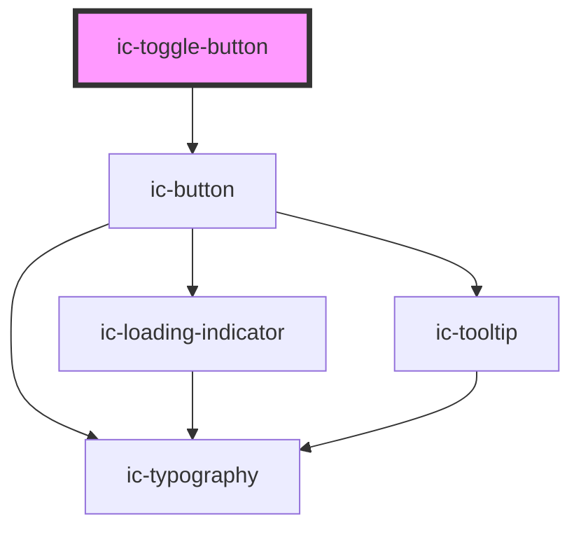

# ic-toggle-button

<!-- Auto Generated Below -->

## Properties

| Property           | Attribute           | Description                                                                                                                             | Type                                                  | Default     |
| ------------------ | ------------------- | --------------------------------------------------------------------------------------------------------------------------------------- | ----------------------------------------------------- | ----------- |
| `accessibleLabel`  | `accessible-label`  | The accessible label that will be applied to the toggle button. This is required for the icon variant of toggle buttons.                | `string \| undefined`                                 | `undefined` |
| `checked`          | `checked`           | If `true`, the toggle button will be in a checked state.                                                                                | `boolean \| undefined`                                | `false`     |
| `disabled`         | `disabled`          | If `true`, the toggle button will be in disabled state.                                                                                 | `boolean \| undefined`                                | `false`     |
| `fullWidth`        | `full-width`        | If `true`, the toggle button will fill the width of the container.                                                                      | `boolean \| undefined`                                | `false`     |
| `iconPlacement`    | `icon-placement`    | The placement of the icon in relation to the toggle button label.                                                                       | `"left" \| "right" \| "top" \| undefined`             | `"left"`    |
| `label`            | `label`             | The label to display in the toggle button. This is required for the default variant of toggle buttons.                                  | `string \| undefined`                                 | `undefined` |
| `loading`          | `loading`           | If `true`, the toggle button will be in loading state.                                                                                  | `boolean \| undefined`                                | `false`     |
| `monochrome`       | `monochrome`        | If `true`, the toggle button will display as black in the light theme, and white in dark theme.                                         | `boolean \| undefined`                                | `false`     |
| `size`             | `size`              | The size of the toggle button to be displayed.                                                                                          | `"large" \| "medium" \| "small" \| undefined`         | `"medium"`  |
| `theme`            | `theme`             | Sets the theme color to the dark or light theme color. "inherit" will set the color based on the system settings or ic-theme component. | `"dark" \| "inherit" \| "light" \| undefined`         | `"inherit"` |
| `tooltipPlacement` | `tooltip-placement` | The position of the tooltip in relation to the toggle button.                                                                           | `"bottom" \| "left" \| "right" \| "top" \| undefined` | `"bottom"`  |
| `variant`          | `variant`           | The variant of the toggle button.                                                                                                       | `"default" \| "icon" \| undefined`                    | `"default"` |

## Events

| Event             | Description                                   | Type                                 |
| ----------------- | --------------------------------------------- | ------------------------------------ |
| `icToggleChecked` | Emitted when the user clicks a toggle button. | `CustomEvent<{ checked: boolean; }>` |

## Slots

| Slot      | Description                                                    |
| --------- | -------------------------------------------------------------- |
| `"badge"` | Badge component overlaying the top right of the toggle button. |
| `"icon"`  | Content will be displayed alongside the toggle button label.   |

## Dependencies

### Depends on

- [ic-button](../ic-button)

### Graph

----------------------------------------------

