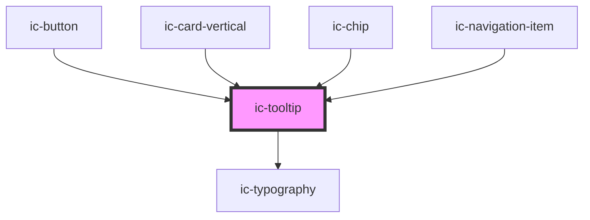

# ic-tooltip

<!-- Auto Generated Below -->

## Properties

| Property             | Attribute       | Description                                                                                                                          | Type                                                                                                                                                                 | Default     |
| -------------------- | --------------- | ------------------------------------------------------------------------------------------------------------------------------------ | -------------------------------------------------------------------------------------------------------------------------------------------------------------------- | ----------- |
| `disableHover`       | `disable-hover` | If `true`, the tooltip will not be displayed on hover, it will require a click.                                                      | `boolean`                                                                                                                                                            | `false`     |
| `label` _(required)_ | `label`         | The text to display on the tooltip.                                                                                                  | `string`                                                                                                                                                             | `undefined` |
| `maxLines`           | `max-lines`     | The number of lines to display before truncating the text.                                                                           | `number`                                                                                                                                                             | `undefined` |
| `placement`          | `placement`     | The position of the tooltip in relation to the parent element.                                                                       | `"bottom" \| "bottom-end" \| "bottom-start" \| "left" \| "left-end" \| "left-start" \| "right" \| "right-end" \| "right-start" \| "top" \| "top-end" \| "top-start"` | `"bottom"`  |
| `target`             | `target`        | The ID of the element the tooltip is describing - for when aria-labelledby or aria-describedby is used.                              | `string`                                                                                                                                                             | `undefined` |
| `theme`              | `theme`         | Sets the tooltip to the dark or light theme colors. "inherit" will set the color based on the system settings or ic-theme component. | `"dark" \| "inherit" \| "light"`                                                                                                                                     | `"inherit"` |

## Methods

### `displayTooltip(show: boolean, persistTooltip?: boolean) => Promise<void>`

Method to programmatically show/hide the tooltip without needing to interact with an anchor element

#### Parameters

| Name             | Type      | Description                                                                                                                          |
| ---------------- | --------- | ------------------------------------------------------------------------------------------------------------------------------------ |
| `show`           | `boolean` | Whether to show or hide the tooltip                                                                                                  |
| `persistTooltip` | `boolean` | Whether the tooltip should stay on the screen when actions are performed that would previously dismiss the tooltip, such as on hover |

#### Returns

Type: `Promise<void>`

## Dependencies

### Used by

 - [ic-button](../ic-button)
 - [ic-card-vertical](../ic-card-vertical)
 - [ic-chip](../ic-chip)
 - [ic-navigation-item](../ic-navigation-item)

### Depends on

- [ic-typography](../ic-typography)

### Graph

----------------------------------------------

