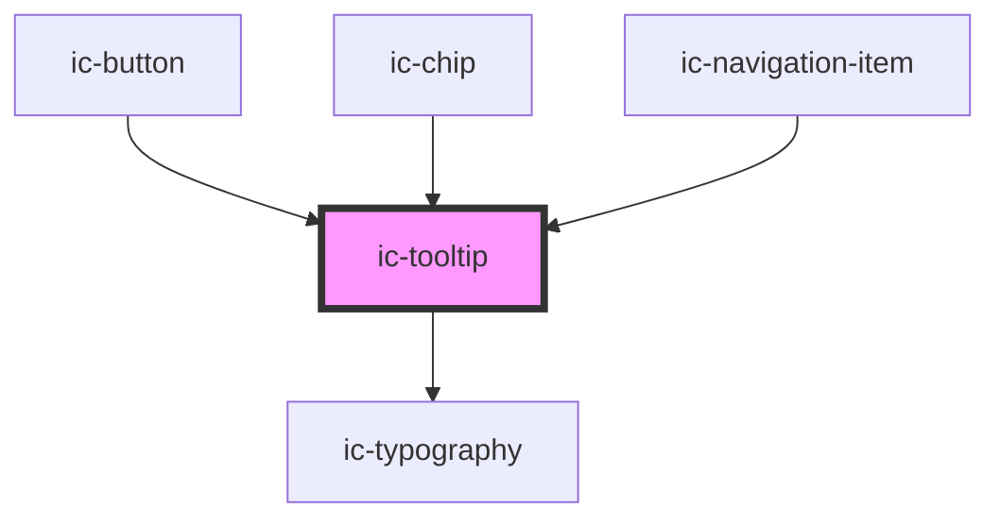

# ic-tooltip

<!-- Auto Generated Below -->

## Properties

| Property             | Attribute       | Description                                                                                             | Type                                                                                                                                                                 | Default     |
| -------------------- | --------------- | ------------------------------------------------------------------------------------------------------- | -------------------------------------------------------------------------------------------------------------------------------------------------------------------- | ----------- |
| `disableHover`       | `disable-hover` | If `true`, the tooltip will not be displayed on hover, it will require a click.                         | `boolean`                                                                                                                                                            | `false`     |
| `label` _(required)_ | `label`         | The text to display on the tooltip.                                                                     | `string`                                                                                                                                                             | `undefined` |
| `placement`          | `placement`     | The position of the tool-tip in relation to the parent element.                                         | `"bottom" \| "bottom-end" \| "bottom-start" \| "left" \| "left-end" \| "left-start" \| "right" \| "right-end" \| "right-start" \| "top" \| "top-end" \| "top-start"` | `"bottom"`  |
| `target`             | `target`        | The ID of the element the tooltip is describing - for when aria-labelledby or aria-describedby is used. | `string`                                                                                                                                                             | `undefined` |

## Dependencies

### Used by

 - [ic-button](../ic-button)
 - [ic-chip](../ic-chip)
 - [ic-navigation-item](../ic-navigation-item)

### Depends on

- [ic-typography](../ic-typography)

### Graph

----------------------------------------------

