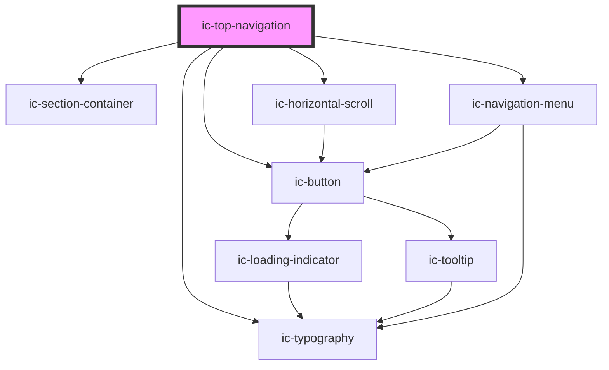

# ic-top-navigation

<!-- Auto Generated Below -->

## Properties

| Property         | Attribute         | Description                                                                                     | Type                                 | Default        |
| ---------------- | ----------------- | ----------------------------------------------------------------------------------------------- | ------------------------------------ | -------------- |
| `appTitle`       | `app-title`       | The app title to be displayed. This is required, unless a slotted app title link is used.       | `string`                             | `undefined`    |
| `contentAligned` | `content-aligned` | The alignment of the top navigation content.                                                    | `"center" \| "full-width" \| "left"` | `"full-width"` |
| `href`           | `href`            | The URL to navigate to when the app title is clicked.                                           | `string`                             | `"/"`          |
| `inline`         | `inline`          | If `true`, the flyout navigation menu on small devices will be contained by the parent element. | `boolean`                            | `false`        |
| `status`         | `status`          | The status info to be displayed.                                                                | `string`                             | `""`           |
| `version`        | `version`         | The version info to be displayed.                                                               | `string`                             | `""`           |

## Slots

| Slot            | Description                                                                         |
| --------------- | ----------------------------------------------------------------------------------- |
| `"app-icon"`    | Content will be rendered to left of app title.                                      |
| `"app-title"`   | Handle routing by nesting a route in the app title.                                 |
| `"buttons"`     | Content will be rendered to right of search bar.                                    |
| `"navigation"`  | Content will be rendered in navigation panel.                                       |
| `"search"`      | Content will be rendered in search area to left of buttons.                         |
| `"toggle-icon"` | Icon to be displayed on the button to toggle search slot content on smaller devices |

## Dependencies

### Depends on

- [ic-section-container](../ic-section-container)
- [ic-typography](../ic-typography)
- [ic-button](../ic-button)
- [ic-horizontal-scroll](../ic-horizontal-scroll)
- [ic-navigation-menu](../ic-navigation-menu)

### Graph

----------------------------------------------

