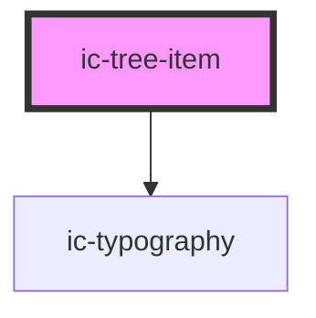

# ic-tree-item

<!-- Auto Generated Below -->

## Properties

| Property   | Attribute  | Description                                   | Type                              | Default     |
| ---------- | ---------- | --------------------------------------------- | --------------------------------- | ----------- |
| `disabled` | `disabled` | If `true`, the tree item will be disabled.    | `boolean`                         | `false`     |
| `expanded` | `expanded` | If `true`, the tree item appears expanded.    | `boolean`                         | `false`     |
| `label`    | `label`    | The section header outlining section content. | `string`                          | `""`        |
| `size`     | `size`     | The size of the tree item.                    | `"default" \| "large" \| "small"` | `"default"` |

## Methods

### `setFocus() => Promise<void>`

Sets focus on tree item heading.

#### Returns

Type: `Promise<void>`

## Slots

| Slot      | Description                                 |
| --------- | ------------------------------------------- |
| `"icon"`  | Content is placed to the left of the label. |
| `"label"` | Content is placed as the tree view label.   |

## Dependencies

### Depends on

- [ic-typography](../ic-typography)

### Graph

----------------------------------------------

