# ic-typography

<!-- Auto Generated Below -->

## Properties

| Property               | Attribute                | Description                                                                                                                                                                           | Type                                                                                                                                                                                                       | Default     |
| ---------------------- | ------------------------ | ------------------------------------------------------------------------------------------------------------------------------------------------------------------------------------- | ---------------------------------------------------------------------------------------------------------------------------------------------------------------------------------------------------------- | ----------- |
| `applyVerticalMargins` | `apply-vertical-margins` | If `true`, appropriate top and bottom margins will be applied to the typography.                                                                                                      | `boolean`                                                                                                                                                                                                  | `false`     |
| `bold`                 | `bold`                   | If `true`, the typography will have a bold font weight. Note: This will have no impact on variants that already use an equivalent or higher font weight (h1, h2, and subtitle-large). | `boolean`                                                                                                                                                                                                  | `false`     |
| `italic`               | `italic`                 | If `true`, the typography will have an italic font style.                                                                                                                             | `boolean`                                                                                                                                                                                                  | `false`     |
| `maxLines`             | `max-lines`              | The number of lines to display before truncating the text, only used for the 'body' variant.                                                                                          | `number`                                                                                                                                                                                                   | `undefined` |
| `strikethrough`        | `strikethrough`          | If `true`, the typography will have a line through it.                                                                                                                                | `boolean`                                                                                                                                                                                                  | `false`     |
| `underline`            | `underline`              | If `true`, the typography will have a line under it.                                                                                                                                  | `boolean`                                                                                                                                                                                                  | `false`     |
| `variant`              | `variant`                | The ICDS typography style to use.                                                                                                                                                     | `"body" \| "caption" \| "caption-uppercase" \| "code-extra-small" \| "code-large" \| "code-small" \| "h1" \| "h2" \| "h3" \| "h4" \| "label" \| "label-uppercase" \| "subtitle-large" \| "subtitle-small"` | `"body"`    |

## Dependencies

### Used by

 - [ic-alert](../ic-alert)
 - [ic-back-to-top](../ic-back-to-top)
 - [ic-card](../ic-card)
 - [ic-checkbox](../ic-checkbox)
 - [ic-chip](../ic-chip)
 - [ic-classification-banner](../ic-classification-banner)
 - [ic-data-entity](../ic-data-entity)
 - [ic-data-row](../ic-data-row)
 - [ic-dialog](../ic-dialog)
 - [ic-footer](../ic-footer)
 - [ic-footer-link-group](../ic-footer-link-group)
 - [ic-hero](../ic-hero)
 - [ic-input-label](../ic-input-label)
 - [ic-input-validation](../ic-input-validation)
 - [ic-loading-indicator](../ic-loading-indicator)
 - [ic-menu](../ic-menu)
 - [ic-menu-group](../ic-menu-group)
 - [ic-menu-item](../ic-menu-item)
 - [ic-navigation-group](../ic-navigation-group)
 - [ic-navigation-item](../ic-navigation-item)
 - [ic-navigation-menu](../ic-navigation-menu)
 - [ic-page-header](../ic-page-header)
 - [ic-pagination-item](../ic-pagination-item)
 - [ic-popover-menu](../ic-popover-menu)
 - [ic-radio-option](../ic-radio-option)
 - [ic-select](../ic-select)
 - [ic-side-navigation](../ic-side-navigation)
 - [ic-status-tag](../ic-status-tag)
 - [ic-step](../ic-step)
 - [ic-switch](../ic-switch)
 - [ic-tab](../ic-tab)
 - [ic-text-field](../ic-text-field)
 - [ic-toast](../ic-toast)
 - [ic-tooltip](../ic-tooltip)
 - [ic-top-navigation](../ic-top-navigation)

### Graph

```mermaid
graph TD;
  ic-alert --> ic-typography
  ic-back-to-top --> ic-typography
  ic-card --> ic-typography
  ic-checkbox --> ic-typography
  ic-chip --> ic-typography
  ic-classification-banner --> ic-typography
  ic-data-entity --> ic-typography
  ic-data-row --> ic-typography
  ic-dialog --> ic-typography
  ic-footer --> ic-typography
  ic-footer-link-group --> ic-typography
  ic-hero --> ic-typography
  ic-input-label --> ic-typography
  ic-input-validation --> ic-typography
  ic-loading-indicator --> ic-typography
  ic-menu --> ic-typography
  ic-menu-group --> ic-typography
  ic-menu-item --> ic-typography
  ic-navigation-group --> ic-typography
  ic-navigation-item --> ic-typography
  ic-navigation-menu --> ic-typography
  ic-page-header --> ic-typography
  ic-pagination-item --> ic-typography
  ic-popover-menu --> ic-typography
  ic-radio-option --> ic-typography
  ic-select --> ic-typography
  ic-side-navigation --> ic-typography
  ic-status-tag --> ic-typography
  ic-step --> ic-typography
  ic-switch --> ic-typography
  ic-tab --> ic-typography
  ic-text-field --> ic-typography
  ic-toast --> ic-typography
  ic-tooltip --> ic-typography
  ic-top-navigation --> ic-typography
  style ic-typography fill:#f9f,stroke:#333,stroke-width:4px
```

----------------------------------------------

