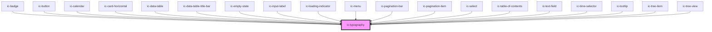

# ic-typography

<!-- Auto Generated Below -->

## Properties

| Property               | Attribute                | Description                                                                                                                                                                           | Type                                                                                                                                                                                                                                                | Default     |
| ---------------------- | ------------------------ | ------------------------------------------------------------------------------------------------------------------------------------------------------------------------------------- | --------------------------------------------------------------------------------------------------------------------------------------------------------------------------------------------------------------------------------------------------- | ----------- |
| `applyVerticalMargins` | `apply-vertical-margins` | If `true`, appropriate top and bottom margins will be applied to the typography.                                                                                                      | `boolean \| undefined`                                                                                                                                                                                                                              | `false`     |
| `bold`                 | `bold`                   | If `true`, the typography will have a bold font weight. Note: This will have no impact on variants that already use an equivalent or higher font weight (h1, h2, and subtitle-large). | `boolean \| undefined`                                                                                                                                                                                                                              | `false`     |
| `italic`               | `italic`                 | If `true`, the typography will have an italic font style.                                                                                                                             | `boolean \| undefined`                                                                                                                                                                                                                              | `false`     |
| `maxLines`             | `max-lines`              | The number of lines to display before truncating the text, only used for the 'body' variant.                                                                                          | `number \| undefined`                                                                                                                                                                                                                               | `undefined` |
| `strikethrough`        | `strikethrough`          | If `true`, the typography will have a line through it.                                                                                                                                | `boolean \| undefined`                                                                                                                                                                                                                              | `false`     |
| `theme`                | `theme`                  | Sets the text color to the dark or light theme color. "inherit" will set the color based on the system settings or ic-theme component.                                                | `"dark" \| "inherit" \| "light" \| undefined`                                                                                                                                                                                                       | `"inherit"` |
| `underline`            | `underline`              | If `true`, the typography will have a line under it.                                                                                                                                  | `boolean \| undefined`                                                                                                                                                                                                                              | `false`     |
| `variant`              | `variant`                | The ICDS typography style to use.                                                                                                                                                     | `"badge" \| "badge-small" \| "body" \| "caption" \| "caption-uppercase" \| "code-extra-small" \| "code-large" \| "code-small" \| "h1" \| "h2" \| "h3" \| "h4" \| "label" \| "label-uppercase" \| "subtitle-large" \| "subtitle-small" \| undefined` | `"body"`    |

## Dependencies

### Used by

 - [ic-badge](../ic-badge)
 - [ic-button](../ic-button)
 - [ic-calendar](../../../../canary-web-components/src/components/ic-calendar)
 - [ic-card-horizontal](../../../../canary-web-components/src/components/ic-card-horizontal)
 - [ic-data-table](../../../../canary-web-components/src/components/ic-data-table)
 - [ic-data-table-title-bar](../../../../canary-web-components/src/components/ic-data-table-title-bar)
 - [ic-empty-state](../ic-empty-state)
 - [ic-input-label](../ic-input-label)
 - [ic-loading-indicator](../ic-loading-indicator)
 - [ic-menu](../ic-menu)
 - [ic-pagination-bar](../../../../canary-web-components/src/components/ic-pagination-bar)
 - [ic-pagination-item](../ic-pagination-item)
 - [ic-select](../ic-select)
 - [ic-table-of-contents](../../../../canary-web-components/src/components/ic-table-of-contents)
 - [ic-text-field](../ic-text-field)
 - [ic-time-selector](../../../../canary-web-components/src/components/ic-time-selector)
 - [ic-tooltip](../ic-tooltip)
 - [ic-tree-item](../../../../canary-web-components/src/components/ic-tree-item)
 - [ic-tree-view](../../../../canary-web-components/src/components/ic-tree-view)

### Graph

```mermaid
graph TD;
  ic-badge --> ic-typography
  ic-button --> ic-typography
  ic-calendar --> ic-typography
  ic-card-horizontal --> ic-typography
  ic-data-table --> ic-typography
  ic-data-table-title-bar --> ic-typography
  ic-empty-state --> ic-typography
  ic-input-label --> ic-typography
  ic-loading-indicator --> ic-typography
  ic-menu --> ic-typography
  ic-pagination-bar --> ic-typography
  ic-pagination-item --> ic-typography
  ic-select --> ic-typography
  ic-table-of-contents --> ic-typography
  ic-text-field --> ic-typography
  ic-time-selector --> ic-typography
  ic-tooltip --> ic-typography
  ic-tree-item --> ic-typography
  ic-tree-view --> ic-typography
  style ic-typography fill:#f9f,stroke:#333,stroke-width:4px
```

----------------------------------------------

